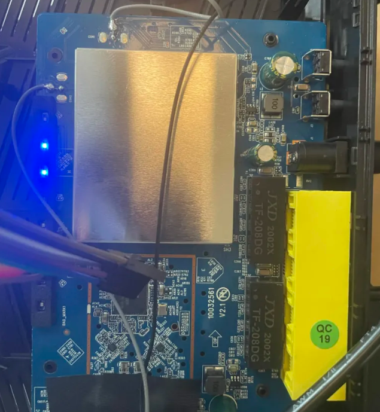
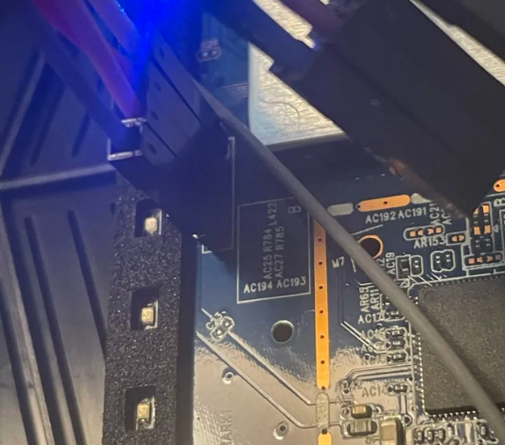
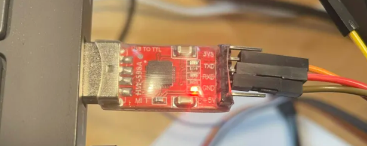
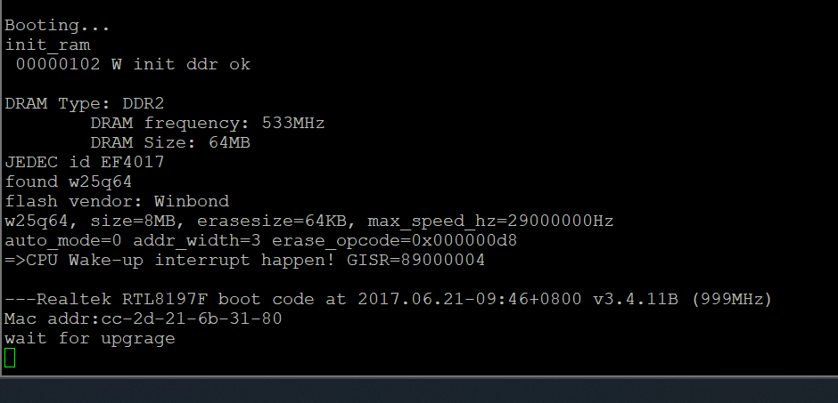
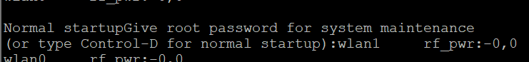
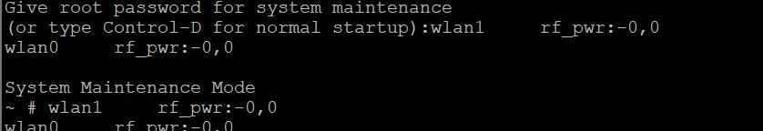
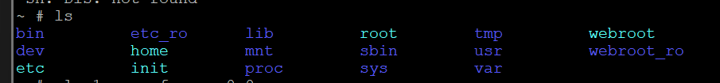
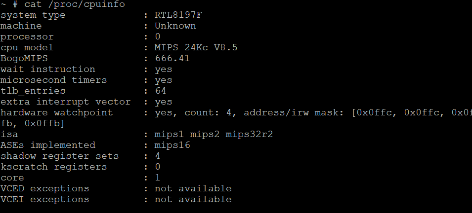
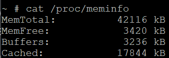

Hello all, 
I spent this weekend poking around this router that I found in the stata loading docks. It is a Tenda AC1200 AC6 model router.

I first started by cracking open the case. the inside is actually quite barebones. 

Its a single blue PCB with a front IO section, a RT8812BRH wireless controller, and some unknown electronics under the shield.



The RT8812BRH is a wireless controller produced by Realtek. I've gone ahead and procured the datasheet which was fairly easily available online.
> "The Realtek RTL8812BRH-VN-CG is a highly integrated single-chip that support 2-stream 802.11ac
solutions with Wireless LAN (WLAN) PCI Express network interface. It combines a WLAN MAC, a 2T2R
capable WLAN baseband, and RF in a single chip"

Essentially it is a 5GHz wifi radio IC. Most likely, the actual processor of the router is underneath the metal shielding which I'll remove some other time.

This chip has two channels for transmitting and receiving 5GHz data (and only 5 GHz). It transmits and receives at 866.7Mbps with a 80MHz bandwidth using 256-QAM.

# Finding the UART pins

Inspecting the board, I identified a set of 4 pins that seem to be a UART header. 



UART stands for Universal Asynchronous Receiver/Transmitter, and it is a protocol for serial communication with all sorts of devices including the router. In particular it turns out that these kinds of devices often run onboard embedded linux systems. Using this protocol we can actually talk to the onboard processor and run some commands and our own code.

The protocol requires at least 3 wires which are: ground, receive, and transmit. Receive and transmit are always relative to the device that is transmitting, so we have to remember to flip the receive and transmit pins when we are hooking up our uart to USB device.

I soldered on a row of headers to connect my uart-to-usb device, which is essentially just going to allow me to talk to the router through my laptop.



This is the uart tool I used

Now I open up PuTTY on my computer which is the terminal emulator that I will use.



Plugging in the router shows that its booting up!

We also see that its booting up from the winbond w25q64 flash chip on the PCB. We'll take a look at this shortly and try to read the firmware off it.

After we let the router finish booting up, we'll see that it asks us for a password. Fortunately, a short google search gave me the debug password to the device which is "Fireitup".





Now we're in.



Doing ``ls`` reveals that we're basically in a normal linux environment. However, a lot of the standard commands and such have been stripped to reduce resource usage.

# Whats the goal today?
I think it'd be cool to hack into this router so that it would display some kind of new webpage that I choose.
However, taking a look at the resources onboard this device via ```cat /proc/cpuinfo``` and ```cat \proc\meminfo```:

<div style="display: flex; flex-direction: row; align-items: center; justify-content: center; gap: 20px">
	
	
</div>

This is a single core CPU, running the MIPS instruction set. It only has about 42MB total and 3.5MB available on the flash. the space available in RAM is even smaller, at just 3MB. Resources will be extremely tight on this device as any uploaded programs can only live in RAM. the flash chip is read only for now.

Additionally, there are no compilers on this machine so the approach i ended up using was to write a minimal web server on my laptop in C, compile it to MIPS machine-code binary, and then upload the binary to the machine via wget'ing a web server on my laptop. Finally I can execute the binary file and the router should start serving the webpage.

```c
#include <string.h>
#include <unistd.h>
#include <netinet/in.h>
#include <sys/socket.h>

int main(void) {
    int s = socket(AF_INET, SOCK_STREAM, 0);
    int opt = 1;
    setsockopt(s, SOL_SOCKET, SO_REUSEADDR, &opt, sizeof(opt));
    struct sockaddr_in a;
    memset(&a, 0, sizeof(a));
    a.sin_family = AF_INET;
    a.sin_addr.s_addr = INADDR_ANY;
    a.sin_port = htons(8080); //serve the website on port 8080
    bind(s, (struct sockaddr *)&a, sizeof(a));
    listen(s, 8);
    const char *resp =
        "HTTP/1.1 200 OK\r\n"
        "Content-Type: text/html\r\n"
        "Connection: close\r\n"
        "\r\n"
        "<h1>Hello World</h1>\n";
    char buf[1024];
    for (;;) {
        int c = accept(s, 0, 0);
        if (c < 0) continue;
        read(c, buf, sizeof(buf));      /* read the request, ignore it */
        write(c, resp, strlen(resp));   /* send the fixed page */
        close(c);
    }
    return 0;
}
```

Here is the minimal web server that is running on the router.

I then compiled it in a WSL terminal 
```shell
mipsel-linux-gnu-gcc -static -no-pie -Os -o hello hello.c
```
- ```mipsel-linux-gnu-gcc``` is a compiler that compiles C into MIPS machine-code binary. 
- ```-static``` tells the compiler to use static linking. This means that all dependencies are packaged into the binary. The router has basically no libraries assumed to be preinstalled so this is necessary.
- ```-no-pie``` means that we do not compile to a "position independent executable". older linux kernels can have buggy support for PIE executables so I set this here to prevent an error here.
- ```-Os``` means to optimize the binary for minimal size.

Interestingly the first time I tried this, the router gave the error "missing ( on line 1" despite the code compiling without issue on my machine. The problem was due to the fact that the RTL819x SoC is actually little-endian not big-endian. mips compiles into big-endian machine code, so it was not able to run on the CPU. I fixed this by compiling using mipsel not mips.

Anyways I now have the raw binary that the router can run.

Now I need to set up the web server so that the router can download it off my computer.
I use a powershell script to serve the files out of my project directory out of port 8000.
```powershell
$root = "C:\Users\cadmi\OneDrive\Documents\GitHub\routerhack"
$l = [System.Net.HttpListener]::new()
$l.Prefixes.Add("http://+:8000/")
$l.Start()
Write-Host "Serving $root on port 8000. Ctrl+C to stop."
while ($l.IsListening) {
    $ctx  = $l.GetContext()
    $path = $ctx.Request.Url.LocalPath.TrimStart('/')
    $file = Join-Path $root $path
    if (Test-Path $file) {
        $bytes = [System.IO.File]::ReadAllBytes($file)
        $ctx.Response.ContentLength64 = $bytes.Length
        $ctx.Response.OutputStream.Write($bytes, 0, $bytes.Length)
    } else {
        $ctx.Response.StatusCode = 404
    }
    $ctx.Response.Close()
}
```

I also have to make sure that port 8000 is open on my laptop since the firewall will normally block it.
```powershell
New-NetFirewallRule -DisplayName "temp-http-8000" -Direction Inbound -LocalPort 8000 -Protocol TCP -Action Allow
```
This just creates a custom firewall rule that allows inbound traffic through port 8000

Now I run the powershell server script
```powershell
Start-Process powershell -Verb RunAs -ArgumentList '-NoExit','-ExecutionPolicy','Bypass','-File','C:\Users\cadmi\OneDrive\Documents\GitHub\routerhack\serve.ps1'
```

The router can now download the compiled binary off my computer via
```shell
wget http://192.168.0.140:8000/hello -O /tmp/hello
```
I found my computer's local IP on the router's network by just plugging it in via ethernet and checking what my computer's local IP was. This script basically just downloads ```hello``` into /tmp/
```powershell
Get-NetIPAddress -AddressFamily IPv4 | Where-Object { $_.IPAddress -like '192.168.*' } | Select-Object IPAddress, InterfaceAlias
```
This lists all IPv4 addresses that begin with 192.168. on my computer. When I plug the router into my laptop it assigns the laptop an ipv4 address.

Finally we can run the binary via chmod
```shell
chmod +x /tmp/hello
/tmp/hello &
```
chmod  +x adds the executable flag to the file. We then run the file and free the terminal.

Now I just go on my browser and navigate to the webpage at ```http://192.168.0.1:8080/```. 192.168.0.1 is the router's local IP on the LAN.


Thus the router has been hacked!


