Hello all, 

I've recently been learning a bit more about writing HDL's and working with FPGA's. The most recent project I have to share is my MNIST accelerator. This page is still under the works as I do some more testing and development, but it should contain the rough idea behind this project.

# Introduction to neural networks
If you aren't familiar, MNIST stands for "Modified National Institute of Standards and Technology". Specifically in the ML space, it refers to the classic problem of handwritten digit recognition. NIST created a database of handwritten digits in the form of 28x28 pixel greyscale images. One example of these images is shown below.

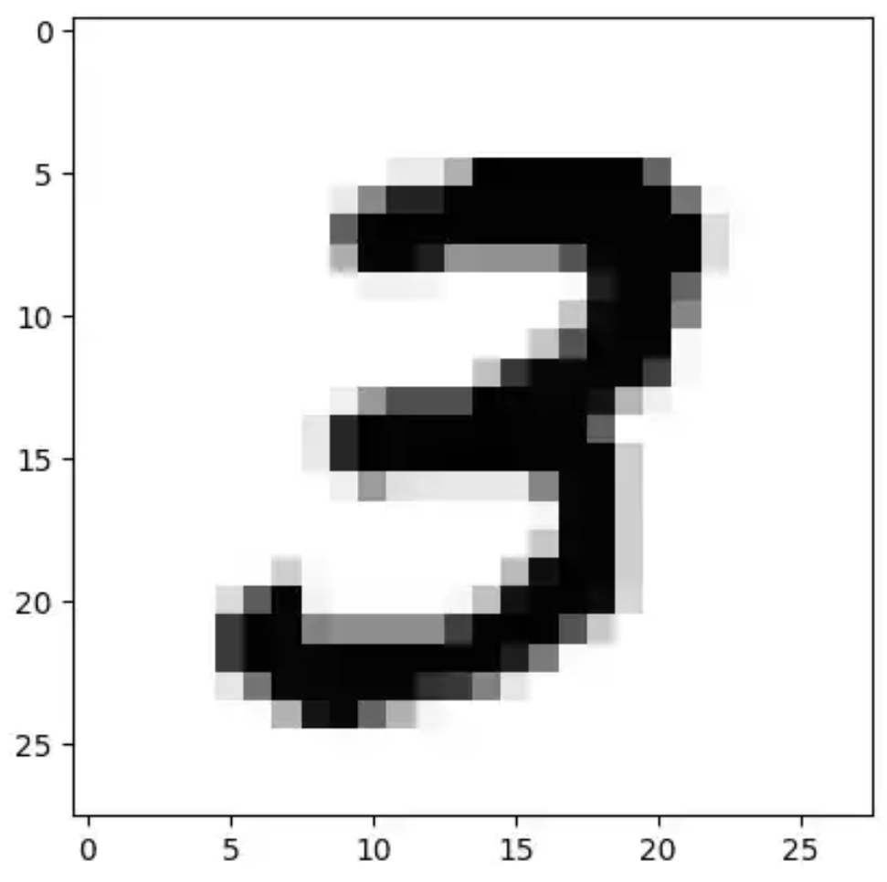

The classic problem is to take in this 28x28 image, and output a decision of which digit it is (ie is it a 1, 2, 3, etc). A typical solution to this is a multilayer perceptron (MLP) with one input layer (784 nodes), one hidden layer (32 nodes), and one output layer (10 nodes)
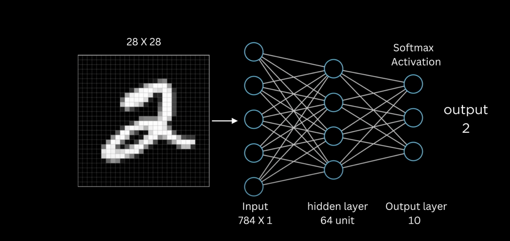
In practice, the middle layer dimension (how many nodes it has) tends to vary quite a bit. i've seen 15 nodes and 64 nodes before, and some implementations even have multiple hidden layers.

In any case, the neural network that I trained had a single hidden layer with only 32 nodes.

First you may wonder, how do we take that image in all of its two-dimensional glory, and stuff it into our network which seems to take in what looks like a vector of length 784?

Well, the solution is that we basically "unfold" the image. each row of 28 pixels in the image is lined up left to right, to form a long chain of 784 pixels. 

This way, the input to the network is basically:
> \[p11, p12, p13, ..., p21, p22, p23, ...\] where p_ij represents the pixel in the ith row and jth column

Now, this input vector is then passed through the network via a series of matrix-vector multiplications, and then out pops an output vector of length 10. We have trained our network such that the 0th element represents "0", the 1st element represents "1", and so on. 
> We call these elements "logits"

To see the final decision, we simply look at what the largest logit is.
> Now, if you go online you may see that some implementations will apply a "softmax" function to the output logits. What this does is basically normalize the logits so that you can interpret their value as a sort of "probability" or "confidence" that the network has in its answer. However, it turns out that implementing such a softmax function on an FPGA would be rather complicated due to the exponentiation and division operations required. Thus, we skip it in this project. However this is perfectly fine because all softmax does is normalize a set of numbers to lie between 0 and 1. It does not change the relative size of these numbers so the largest number will remain the largest number after softmax.

Okay, so now we know that this neural network basically takes in a 28x28 pixel image, unwraps it, passes it through the network, and then we just pick the biggest number in the output which corresponds to the model's prediction of what digit we presented it.

Now this naturally raises the question. what exactly is the "passes it through the network" step?

Well, lets go back to the graphical representation of a neural network:

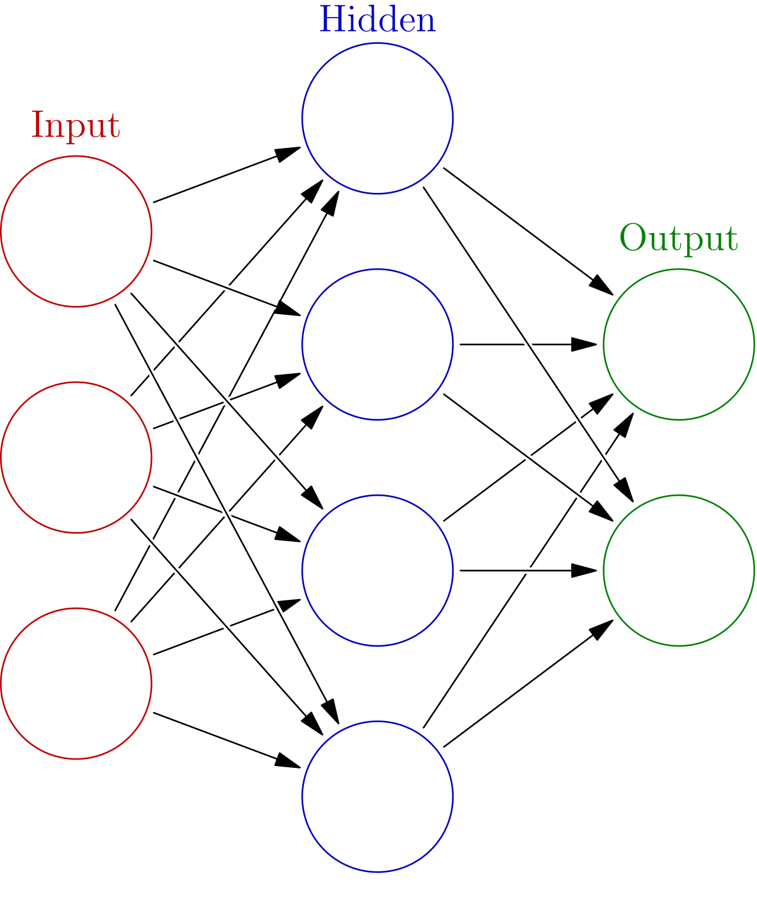

Here is a schematic view of the input, hidden, and output neurons of a typical MLP. As you can see, every input neuron connects to every hidden layer neuron. Each of these "connections" represents a weight (just a number which we discover upon training), which we can denote "w_ij" meaning the weight of the connection from neuron i of the input layer, and j of the output layer.

The way that we determine the value (what we call activations) for the first neuron in the hidden layer is the following:
$$
a_{1}=\text{ReLU}(i_1w_{11} + i_2w_{21} + i_3w_{31})
$$
Here, a_1 is the first activation of the hidden layer, and i1,2,3 are the first second and third values for the input neurons. ReLU is simply a function (we call it an activation function) that returns the max of its input and 0. This means that if the input is negative, it outputs 0, and if it is positive, it passes the input straight through to the output.

In general, to get the entire hidden layer, we can use the following formula.
$$
\vec{a} = \text{ReLU}(W\times\vec{i})
$$
Where "i" is the input vector, and W is the "weight matrix".

Lets take some time now to look at the dimensions of the vector and matrix in my specific neural network.

The vector has 784 elements (28x28) arranged along the rows, and only one column., so we represent its dimensions as (784, 1).

The matrix is supposed to take in a 784 element vector, and output a 32 element vector. Therefore, the correct matrix dimension that does this mapping is (32, 784). It has 32 rows and 784 columns.

We can verify that this produces a vector of dimension (32, 1):
> (32, 784) x (784, 1) = (32, 1)

We can then pass this vector back into the second weight matrix representing the second half of the network. This time the weight matrix maps a 32 element vector to a 10 element vector which is our output.

Okay so when we say "pass the input vector through the network", we really mean that we're computing a matrix multiplication, then passing it through a ReLU function. 
$$
\vec{\text{o}}=\bf{W}_{23}\text{ReLU}(\bf{W}_{12}\vec{i})
$$
Where o is the output vector, W23 is the weight matrix from layer 2 to 3 (hidden to output), W12 is the weight matrix from layer 1 to 2 (input to hidden), and i is the input vector.

What I've created in my project, is essentially just a faster way to do the matrix multiplication step.

## Quantization
In practice the weights that we use to run inference on a neural network can be quite large (32-bit floats for example), so we find it necessary to somehow crunch them down to a smaller form while preserving performance. One method of doing this is called "Quantization" and I used it in this project by using 8-bit quantized weights.

The neural network is trained to with Float32 weights, but we want to store them as int8s so some significant compression is needed.

First we observe that a real value can be represented as an integer divided by a "scale" s.
$$
r = q/s
$$
For each layer in the network, we find the largest weight and use that to calculate the scale. As a reminder, the largest number that a signed int8 can store is 127.
$$
s = 127/ \max(|w|)
$$
Therefore, we need to store the "scale" for every layer.

Now in the first layer of my network, it happens that the largest weight is about 0.416. This gives a scale of about 305.16.
If we now want to quantize a new weight, we just calculate q
$$q = r\times s$$
So if we have a weight of value 0.0312, then we just need to store 
$$
q = 0.0312 \cdot 305.16 = 9.52
$$
We can then round this to 10 so that it is stored as a signed int8.

In hardware, when we perform our multiplications we simply operate on the quantized weights because the scale component factors out.

Now when we pass the output of the first layer into the second layer, we need to perform requantization as layer 1 outputs 32-bit integers. We simply need to perform a right shift of 12 to scale the outputs back down to int8 quantization.

Now when we get to the very last layer, where we need to convert the layer outputs into logits or probabilities, we use argmax. Conveniently argmax does not care particularly about the scale factor, as it selects the largest value relative to all other logits so scale does not have a discriminating effect here.

# Matrix Multiplication
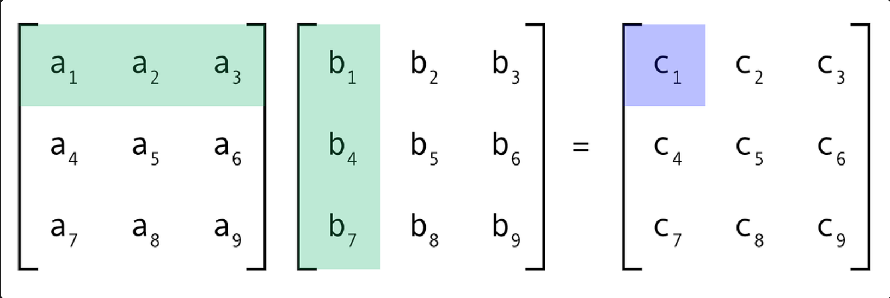
This is the fundamental mathematical operation that I want to accelerate. 

But is it slow to begin with? well, the typical way that your computer would calculate this is to go element by element. It would calculate a1 x b1, then a2 x b2, and so on. then it would sum those entries up, and save that as c1.

In this example, to calculate a single entry of matrix C, we need to do 3 multiplications. there are 9 entries in C, so we need to do 27 multiplications! The underlying idea behind this notion of "slowness" is called time complexity. In general, the naive algorithm i've shared here has a time complexity of O(n^3). 

In our case, we're multiplying a matrix by a vector, Still, the time complexity ends up being about O(n^2), which still isnt great. 

In fact, on a CPU alone, even the best matrix multiplication algorithms only get down to around O(n^2.81).

Anyways, what if I told you we can actually go down to linear time by using parallel computing!

Enter, systolic arrays:

	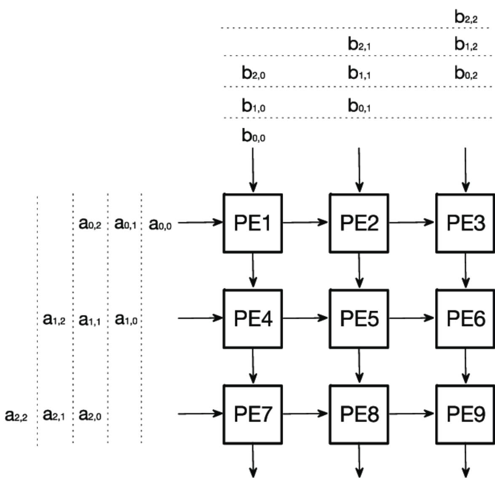

If you go online, you'll probably find all these somewhat cryptic looking diagrams. At least for me, it wasnt very clear how they worked or could be implemented. Hopefully I can explain them at least a bit better than they were explained to me!

The core idea is that we are going to make a small "processing element" or PE. This element will have two inputs from its left and top. It also has two outputs from its right side and the bottom. On the schematic above you can see these inputs as the arrows going in and out of each PE.

The purpose of the processing unit is to do the following:
$$
p_{\text{out}} =p_{\text{in}} + wa_{\text{in}}
$$
P_out exits from the bottom, and p_in enters from the top. "w" is stored inside of the processing element, and "a_in" enters from the left side. The right side outputs "a_out" without any modification.

Every clock cycle, the PE will read its "a_in" and "p_in" input, and then compute "p_out" before the next clock cycle. It will also forward the "a_in" input to the "a_out" output too.

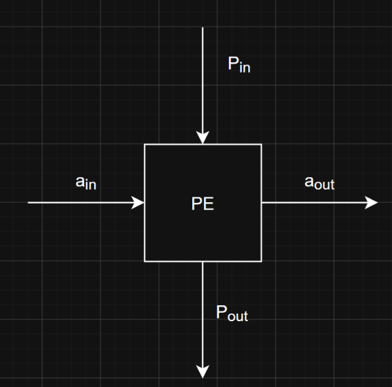

We set up an array of these PE's in sort of a grid. I've set up a 2x2 grid below for us to discuss:

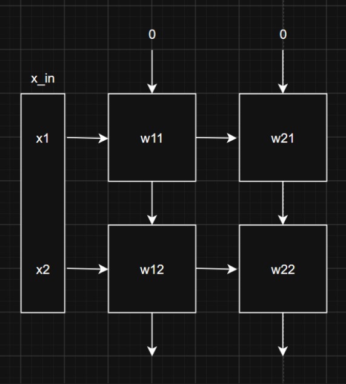

On the first clock cycle, we're going to load in \[x1,0\] into the input

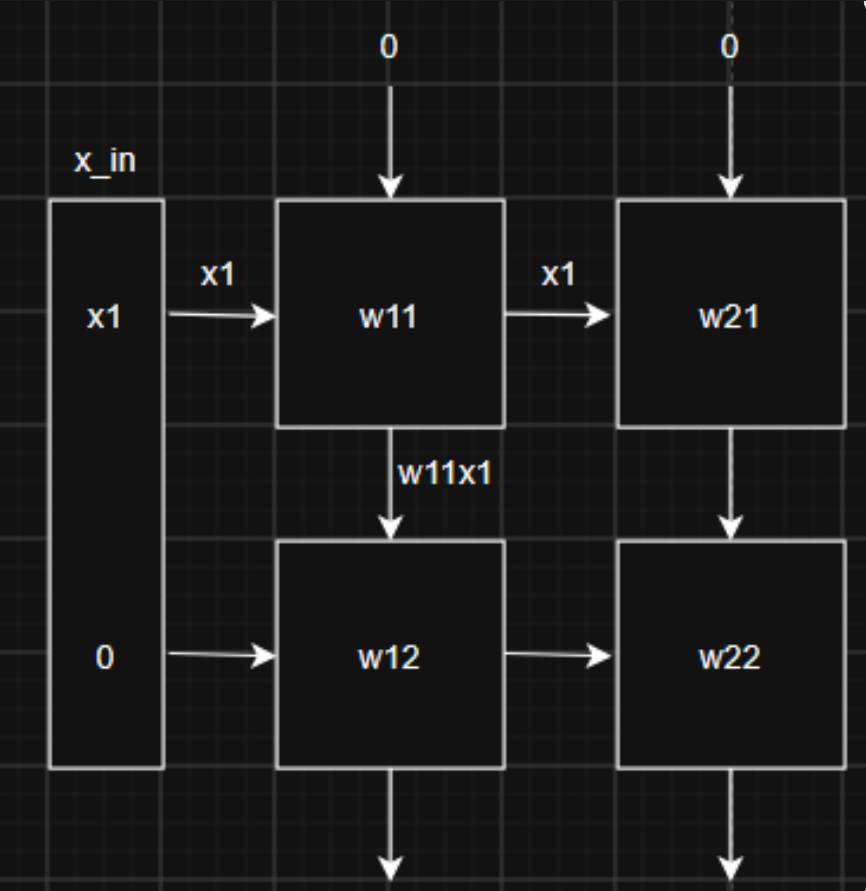

So basically PE w11 has pulled in the x1 input from the left, and the 0 input from the top. it has forwarded the x1 input to the output on the right, and computed w11x1 on the bottom.

Now, we advance the clock again. This time, we pass in \[x1, x2\]. We've basically "turned on" the second input to the array.

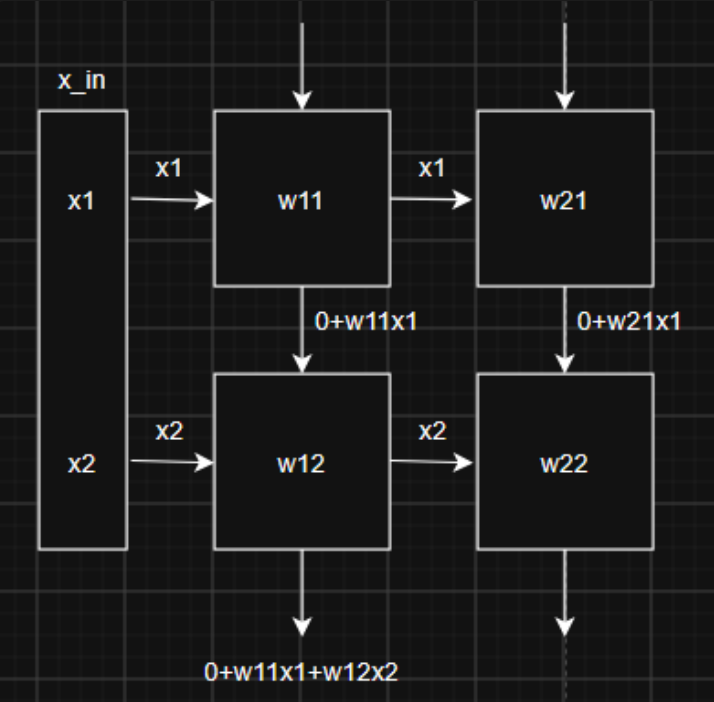

Now on the second clock pulse, two PE's are now active. w21 and w12.
w21 has taken in x1 on the left, and 0 from the top. it outputs 0+w21x1.
w12 has taken in x2 on the left, and 0+w11x1 from the top, and now outputs 0+w11x1+w12x2.
- Note that it has also forwarded x2 to its right output.

Now lets pulse the clock again.

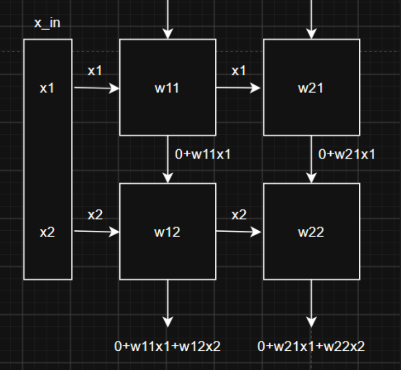

The final PE has updated, w22. It now outputs 0+w21x1+w22x2.

Now, lets think about what we just computed. Doesn't it kind of resemble a matrix multiplication?
Specifically:

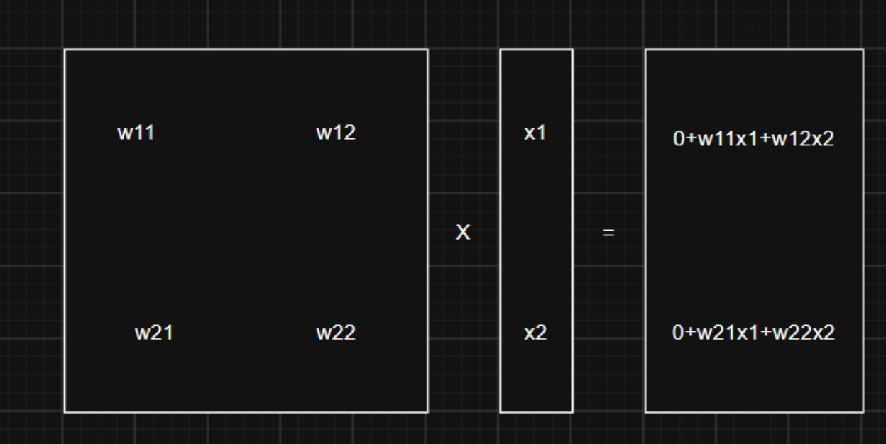

As you can see, we've effectively just done a matrix multiplication! However, with this algorithm it actually only took 3 steps. In general, the number of steps is going to be 2n-1, where n is the number of rows in the processing element array. Notably, this is a linear time algorithm!

One major problem arises though: how do we multiply vectors and matrices that are larger than the processing element? it just isnt really feasible to make gigantic systolic arrays that are 784x784 elements wide, so what do we do?

The solution is tiling! Suppose we have a larger 4x4 matrix, which we want to multiply

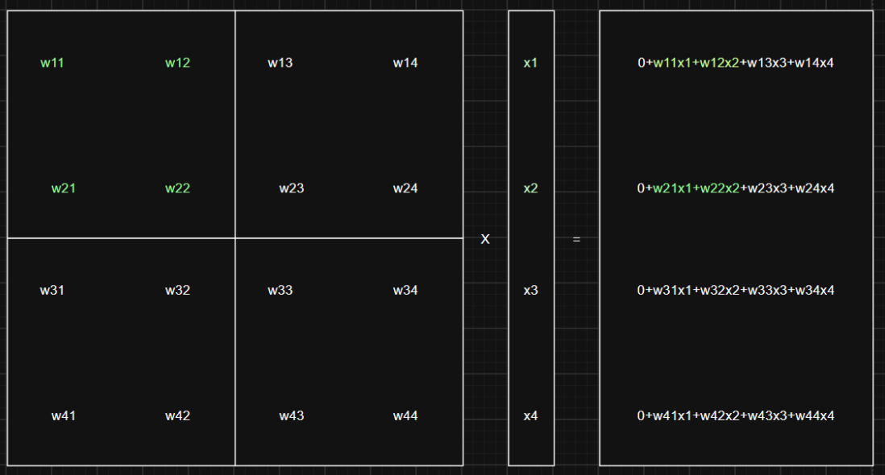

Wow. thats a lot of numbers. However, I've gone ahead and highlighted one "tile" of this 4x4 matrix in green. Notice how the green numbers are just what we already calculated with the systolic array?

The idea here is that we take our 4x4 matrix, and split it into four 2x2 tiles. To compute the matrix vector multiplication, we take a tile (say the green one i've selected), and then load those weights into the systolic array. Then, we grab the corresponding input elements that we need (x1, x2), and then feed those into the systolic array! Then, we end up with one "part" of the final output vector. To get the rest of the first two elements in the output vector, we repeat this tiling process. This time, we grab the weights w13, w14, w23, and w24. We load them into the systolic array like normal, and then grab the input elements x3 and x4. After running the systolic array, we add the results to the running sum and get the finished first two elements.

We repeat this process for the bottom two tiles too.

Now, how do we actually implement this?

# Implementing the systolic array

Okay, so basically if we are given a matrix, we need to somehow store it in our FPGA and then know which elements to grab and when.
How I've tackled this problem is to instantiate several BRAMs within the FPGA. Each BRAM stores one "row" of the tile. Our tiles are 2x2, so we create two BRAMs.
Each address in the BRAM corresponds to a single tile, and the contents at address is essentially a concatenated string of the weights in that tile row.

For example:

|         | BRAM 1   |     |         | BRAM 2   |
| ------- | -------- | --- | ------- | -------- |
| Address | Contents |     | Address | Contents |
| 0       | w11, w12 |     | 0       | w21, w22 |
| 1       | w13, w14 |     | 1       | w23, w24 |
| 2       | w31, w32 |     | 2       | w41, w42 |
| 3       | w33, w34 |     | 3       | w43, w44 |

BRAM 1 corresponds to the top row of a tile, and BRAM 2 corresponds to the bottom row of a tile.
Therefore, the address is essentially a tile index. address 0 corresponds to the top left tile, address 1 corresponds to the top right tile, address 2 corresponds to the bottom left tile, and address 3 corresponds to the bottom right tile.

Now that we've stored the weights in memory, we can load them into the systolic array. We first select a tile to process; lets pick tile 0. Pull the contents out of BRAM 1 first, and load them into the top two weights in the systolic array. Then, pull the contents out of BRAM 2, and then load them into the bottom two weights in the systolic array. 

Now that we've loaded in tile 0, we grab the first two elements of the input vector. We can calculate it from our tile index in general as follows:
$$
i=(t\mod(\text{COLS/TILECOLS}))\times\text{TILECOLS}
$$
Here, t is the tile index. Lets say its "2" for example meaning the third tile or the first tile on the second row. COLS is the number of columns in the matrix, and TILECOLS is the number of columns in a tile.
If t=2, cols = 4, tilecols = 2.
therefore, i = 2 mod (4/2) * 2 = 0, which means we should get the 0th element of the input vector.
Additionally, we also need to get the next TILECOLS-1 elements. so we actually need to get the 0th and 1st elements.

If t=3, aka the bottom right tile, then i = 3 mod (4/2) * 2 = 2, so we get the 2nd and 3rd elements of the input vector.

Okay, so we have the weights. how do we load them into the array? Well, each PE in my design also has a weight write enable and weight input. weights are stored as 8-bit binary numbers, and my array is composed of 8x8 PE's. This means that I have 8 BRAMs, and each BRAM stores 64 bits (8 * 8-bits) of data at each address. This 64-bit word is essentially just 8 8-bit integers concatenated together. We take one of these words from each of the 8 BRAMs, and give them to the systolic array.
The array is designed such that each PE will look at the appropriate word, and then read in the appropriate section of that word.

For example, in the 2x2 systolic array case, lets say we want to process tile 0.

From BRAM1, lets go to address 0 and grab the two weights there; w11w12.
In binary, this would be represented as a 16 bit word. We program the array such that PE1 (ie the top left PE) will look at the first 8 bits of this word, and PE3 (the bottom left PE) will look at the last 8 bits of this word. 
Next, from BRAM2, we go to address 0 and grab those two weights; w21w22. Again, this is a 16-bit word, so we tell PE2 (the top right PE) to look at the first 8-bits, and PE4 (the bottom right PE) to read the last 8-bits.

This generalizes nicely to larger arrays. My array is 8x8, but also uses 8-bit weights. this means that I have 8 BRAMs, and each one stores 64-bit words. in the same way as in the 2x2 case, I assign each PE to look at the right section of the 64-bit word and store that as its weight.

The nice thing is that I can read all of the weights I need out of BRAM in a single clock cycle (as I only ask for one address from each of 8 BRAMs), it only takes 1 more clock cycle to load them into the systolic array memory and immediately begin computation. In theory it takes 2 clock cycles to fill the systolic array regardless of its size, as long as you can find enough BRAM blocks in your FPGA.

Okay, so now we have the weights loaded, and we know what input vectors we need to provide, whats next?

Well, we actually need to feed the input vectors into the systolic array in a staggered fashion. Recall that the second input element needs to come in one clock cycle after the first input element. This is so that we can let the first PE complete its computation so the partial sum input is ready for the next cycle's PE's to process.

This can be done pretty easily too. We use a module called "activation_buffer". Basically, it takes in a start pulse which tells it to sample its input. in this way, it grabs the input vector for the systolic array and saves it internally. And then, we have an internal counter within the buffer which counts from 0 to "r" where r is the number of rows in the systolic array. When the ith element sees that the count is >= i, it begins to output its value to the systolic array.

For example, the 0th element sees that count is always >=0, so it immediately outputs to the array, allowing for the first PE to begin computation. The 1st element only begins outputting after one clock cycle, when the count is equal to 1. the 2nd element begins outputting after two clock cycles and so on. When the count reaches r, it resets back to 0 and we know that the computation is done.

Every time we finish processing a tile, we take those outputs and we toss them into an accumulator register. Once we finish the processing for a single tile, we take that accumulated value and save it as the ith output element.

Anyways, we do this for both weight matrices in the neural network. All we have to do is train up the model on the computer, load the weights into BRAM in the right format, and then we can go ahead with the computation!

# Results

	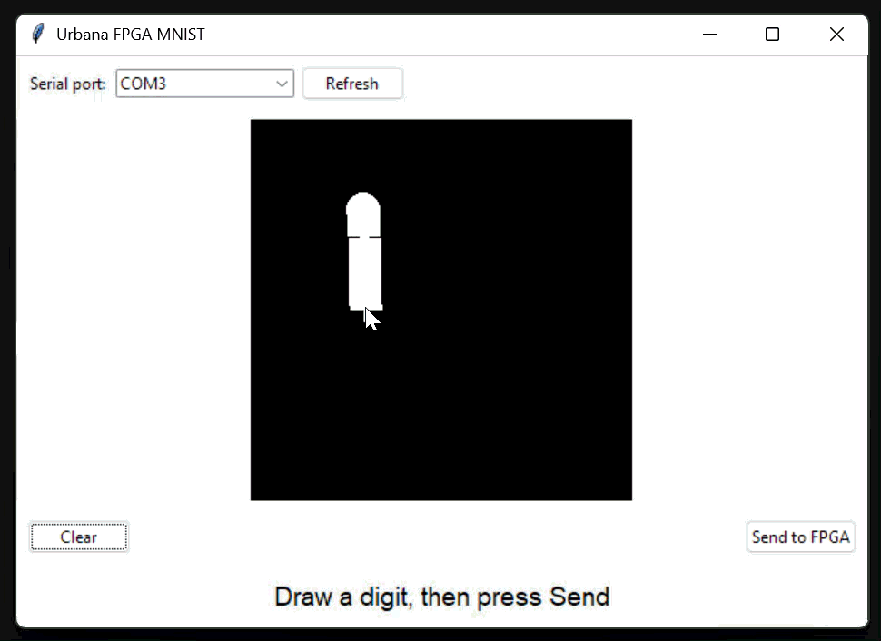

Here is it working!

The accuracy of the model is relatively low (94%) compared to the SOTA (essentially 100%). Quantization surprisingly has little effect on the accuracy as the Float32 weights yield an accuracy of 94.27% while the Int8 weights yield an accuracy of 94.25%. The reason why the accuracy is low is likely because I did not train the network for very long and I also did not implement biases into the network to help with creating the decision boundaries.

The model running on the FPGA has a latency of about 88 microseconds. This is pretty low, but the overall end to end time is dominated by the UART transfer time. This is the time that it takes to move the image to the FPGA.

Now ultimately is this faster than a modern CPU? Probably not. The main time sink here is the process of sending bits from my PC to the FPGA, which needs to be done serially. In practice AI accelerator cards and such use large parallel buses to send data at much higher bandwidths which cuts down this communication time significantly.  Additionally, while 88 microseconds is quite fast, the FPGA runs at 100MHz and I haven't optimized the systolic array to have maximum utilization. Currently the utilization for the array is quite low at 4.5%, so with further optimization the hardware could be pushed further. In any case, this was quite an interesting project for the sake of learning about systolic arrays and hardware acceleration!
# Hardware details

The FPGA I used is the Real Digital Urbana board running the Spartan-7 FPGA by Xilinx. Communication between the PC and the FPGA is done via a uart interface running at 921,600 Baud. 

# See for yourself
I've uploaded the code for this project on github where you can take a look at it.
<a href="https://github.com/Turtlely/mnist-accelerator">  https://github.com/Turtlely/mnist-accelerator </a>

You'll also need to install vivado if you want to build the bitstream and then run it on your own fpga though.
