# Characterization of Piezo Nonlinearity and PID locking
I've written up the following report of what I did this summer. This page will be updated going into the future as I continue my research.
# Experimental Setup
The experimental setup is that we have a Michaelson interferometer where one mirror is fixed and the other mirror is on an open loop piezo stage.

The laser we are using is a thorlabs turnkey laser operating at 1550nm. In practice I have turned down the output power significantly causing the actual wavelength to be closer to about 1553.5nm

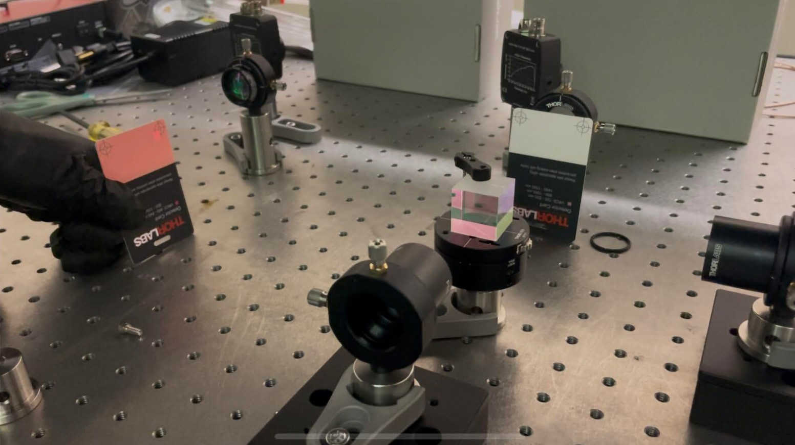

Hardware:
FPGA: https://redpitaya.com/product/stemlab-125-14/
ADC Specs:
	14 bit resolution, 2 input, 125MS/s sampling rate

# Theoretical Work
An interferometer consists of a laser beam traveling down a path where it hits a beamsplitter. The beam then travels down two arms, denoted the reference arm and the signal arm. At the end of each arm is a retroreflector which sends the beam back for recombination and interference. Two photodiodes are placed at each port of the beamsplitter to monitor the resulting brightness.

The photodetector sees the superposition of two beams (the factor of 2 is due to the light taking a round trip)
$$
E_{\text{incident}}=E_0e^{i(\omega t + 2kx_1)}+E_0e^{i(\omega t + 2kx_2)}
$$
Factor out the common part
$$
E_{\text{incident}}=E_0e^{i\omega t}(e^{2ikx_1}+e^{2ikx_2})
$$
Let $x_2=x_1+\delta x$
$$
E_{\text{incident}}=E_0e^{i\omega t}(e^{2ikx_1}+e^{2ik(x_1+\delta x)})
$$
$$
E_{\text{incident}}=E_0e^{i(\omega t+2kx_1)}(1+e^{2ik\delta x})
$$
Find the power by multiplying the incident electric field by the complex conjugate
$$
\tilde P\propto E_0e^{i(\omega t+2kx_1)}(1+e^{2ik\delta x})\times E_0e^{-i(\omega t+2kx_1)}(1+e^{-2ik\delta x})
$$
$$
\tilde P\propto E_0^2(1+e^{2ik\delta x})(1+e^{-2ik\delta x})=E_0^2(1+e^{2ik\delta x}+e^{-2ik\delta x}+1) = E_0^2(2+e^{2ik\delta x}+e^{-2ik\delta x})$$
$$
P\propto 2E_0^2(1+\cos(2k\cdot\delta x))
$$
If we call the $P_0$ the power when $\delta x=0$, then
$$
P(\delta x) = P_0(1+\cos(\frac{4\pi}{\lambda}\delta x))
$$
In terms of laser frequency,
$$
P(\delta x) = P_0(1+\cos(\frac{4\pi\omega}{c}\delta x))
$$
We have two such signals from both photodiodes, but the cosine terms are opposite in magnitude. We subtract them to get the differential intensity
$$
P_\Delta=P_0(1+\cos(\frac{4\pi\omega}{c}\delta x))-P_0(1-\cos(\frac{4\pi\omega}{c}\delta x))
$$
$$
P_\Delta=2P_0\cos(\frac{4\pi\omega}{c}\delta x)
$$

Now, we operate about a linear region in $\delta x$, such that for small displacements,
$$
\boxed{P_\Delta=2P_0\times\frac{4\pi\omega}{c}\delta x}
$$
We also normalize this so we only look at the NDI (normalized differential intensity)
$$
\text{NDI}=\frac{4\pi\omega}{c}\delta x
$$

We then have an estimator for $\delta x$ which we denote $\tilde x$
$$
\tilde x = \frac{\lambda}{4\pi}\times \text{NDI}=\frac{c}{4\pi\omega}\times \text{NDI}
$$


# Driving the piezo and collecting data from the photodiodes
First, we sweep the piezo applied voltage in a triangle wave from 0 volt to 1 volt. The period of this wave is set to 4 seconds (Although in practice it isn't actually exactly 4 seconds).
On the interferometer's two channels IN1 and IN2, we observe the interference pattern as a function of time.

The output of this stage is shown below:
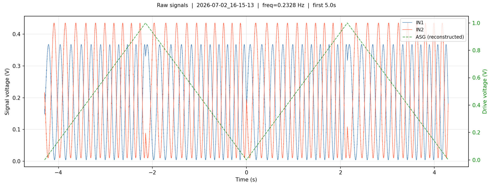

COMMENT: add monitor channel on amplifier output piezo voltage
- Use power meter to measure the output of the beam splitter to see why we get different intensities in each channel
## Acquisition

The acquisition process uses PyRPL's ASG (Arbitrary Signal Generator) and Scope modules.
First, we generate the piezo's drive voltage signal using ASG.
```python
asg = r.asg1
asg.output_direct = 'out1'

asg.setup(
    waveform='ramp',
    frequency=1.0 / CYCLE_DURATION,
    amplitude=(V_END - V_START) / 2,
    offset=(V_END + V_START) / 2,
    trigger_source='immediately',
)
```
In PyRPL, the setting to generate a triangle wave is "ramp".
trigger_source='immediately' tells the Red Pitaya to begin outputting the signal immediately.

Next, we set up the oscilloscope and begin collecting data
```python
s.setup(
    input1='in1',
    input2='in2',
    average=True,
    duration=SCOPE_DURATION,
    trigger_source='asg1',
    trigger_delay=0,
)

ch1, ch2 = s.single(timeout=SCOPE_TIMEOUT)
t = s.times
```
We set up the oscilloscope to read from both channels.
Our measurement lasts about 10 seconds, which is set by SCOPE_DURATION
We set the trigger source to be asg1 with a delay of 0 seconds, which means that set time t=0 to be when the ASG waveform begins. In our case that means that t=0 is set to the start of the triangle wave period.

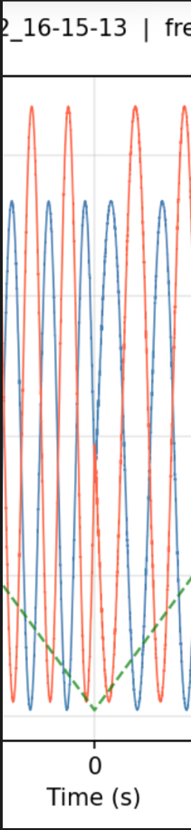

As you can see, at t=0, V=0.

The data is stored in variables ch1, ch2, and t
## Applied voltage
The applied goes between 0V and 1V with a period of roughly 4 seconds. However, this voltage is actually just a mathematical reconstruction of the applied voltage. This is because the Red Pitaya only has two analog inputs, but we require at least 3 (2 for each channel and 1 for monitoring the drive voltage). My solution is to use both input channels for monitoring the photodiode voltages, and mathematically reconstruct the drive voltage.

The applied voltage is generated via the ASG (Arbitrary Signal Generator) module provided by PyRPL. This same module also reports the actual frequency generated by the ASG. Because we know the waveform profile, start and end voltages, and frequency, we can effectively reconstruct the applied voltage. I verified that the reconstruction was accurate in the beginning of the development process as you can see below. 
# Preprocessing the photodiode signals

First of all it is obvious that both photodiodes have different maximum intensities. This is in part because of various power losses in the system (surface coatings, absorption, etc), but also because the beamsplitter used will not perfectly divide power 50-50.
This is corrected via the following formula:
$$
V_i'=\frac{V_i-V_{i,\text{min}}}{V_{i,\text{max}}-V_{i,\text{min}}}
$$
In this way, we apply a normalization to each channel separately. By sweeping the piezo's displacement through many fringes, we can effectively get a very good measure of the maximum and minimum voltage on each channel. This allows us to achieve a consistent high quality normalization such that $0\leq V_i'\leq 1$ always holds.

Next, I observed that there was a consistent phase lag between both photodiode signals. This can be made clear by plotting the NTI, or Normalized Total Intensity given by $\text{NTI}=V_1'+V_2'$.

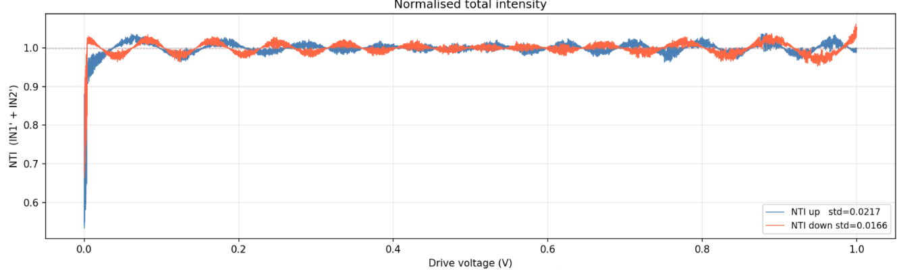

Here, drive voltage can be thought of as a proxy for displacement or time.

Ideally, NTI should be constant and equal one. The deviations from unity are due to a phase lag between both channels. Additionally, I observed that the phase lag was direction dependent; meaning that the lag between ch1 and ch2 was different when the signal arm was extending or contracting.

COMMENT: Add analysis on how error from not  perfect phase alignment affects the estimator
Exclude voltages near 0 (perhaps exclude 0-0.1V?) see if that improves our phase alignment

It is important to ensure that both signals are perfectly out of phase, as this means that their intersections will consistently be at a normalized intensity of 0.5. This means that their normalized differential intensity (NDI), given by $\text{NDI}=V_1'-V_2'$ will be equal to exactly zero at the quadrature point. The point of quadrature is characterized by both beams having the same normalized intensity, so it is important we can get this phase shift correctly applied so that we can reliably find quadrature.

The appropriate phase shift was found by minimizing Var(NTI) as a function of V2's phase lag $\phi$.

Summarizing what we've done so far, 
We normalize each channel independently, once for V1 and once for V2. We then apply a phase lag to V2' for each direction (extension and contraction) of the piezo. This is because the piezo has different behavior in each direction due to hysteresis effects.

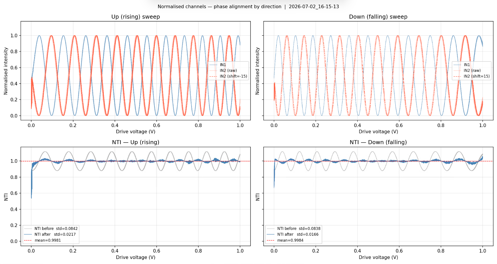

The results of preprocessing are shown above. As you can see, we significantly reduce the variance of NTI in each direction via the phase shift. Additionally, you can notice that the phase shift for the rising sweep happens to be equal and opposite to the phase shift for the falling direction.

I found this phase shift to be extremely consistent across multiple trials spanning a few days.
COMMENT: lock-in amplifier to monitor the phase shift over multiple days quantitatively


Next, we calculate the NDI which is given by $\text{NDI}=V_1' - V_{2,\text{shifted}}'$
The advantage of NDI is that it is a single metric output by the interferometer which is highly proportional to the applied displacement about a quadrature point for small displacements. It also allows us to extract the direction of displacement, and serves as a useful error signal in future closed loop feedback positioning applications.

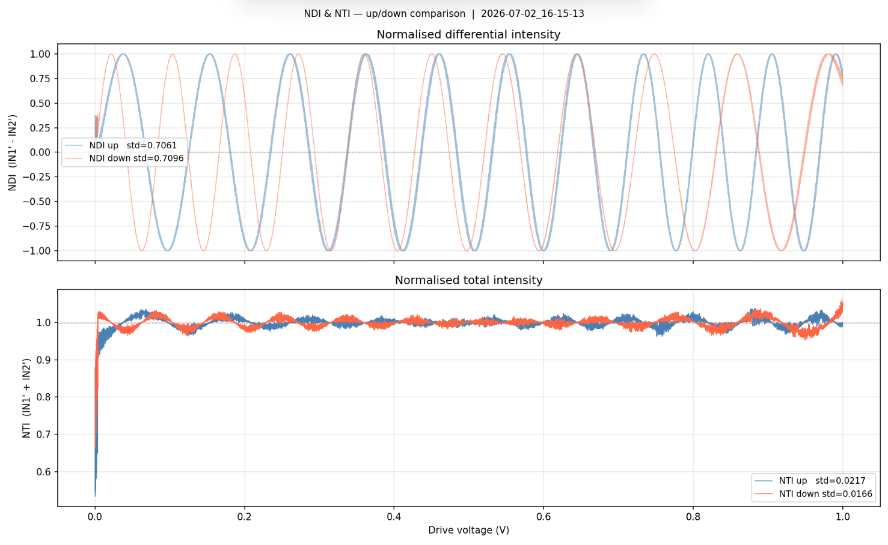

Here we show the NDI and NTI together as a function of the piezo drive voltage.
There are a few things to note:
1. The nonlinearity of the piezo actuator is apparent as you can see that the frequency of the interference fringes tends to increase with the drive voltage
2. Around zero volts, the piezo has more unpredictable behavior and tends to be more noisy.

# Modelling NDI
The ultimate goal is to have the interferometer output a single displacement in nanometers. However, what we have so far is a unitless value of NDI, so how do we convert between the two?

According to our interferometer model, the NDI we measure about a quadrature point can be modelled as the following equation:
$$
\text{NDI} = \sin(\frac{4\pi}{\lambda}\delta x)
$$
Where $\delta x$ is a small displacement about the quadrature point. Using the small angle approximation, we get
$$
\text{NDI} = \frac{4\pi}{\lambda}\delta x
$$

From this, we can determine an estimator for $\delta x$
$$
\widetilde{\delta x} = \frac{\lambda}{4\pi}\times\text{NDI}
$$
This is sufficient for the case where we are at a quadrature point and we want to convert the fluctuations in NDI to a physical displacement.

However, for the purposes of validating and testing our interferometer, we also need to be able to apply precise displacements to the signal mirror. This means that we need to convert a desired physical displacement $x$ to an applied voltage $V$.

This is where the piezo displacement function comes in.
We denote the displacement function of the piezo as $f(V)$. For any given voltage, it outputs the resulting displacement of the piezo. It is also worth noting going ahead that the forward and backward strokes of the piezo have different displacement functions due to hysteresis effects.

Then, we can model the displacement of the signal arm as:
$$
x = f(V)
$$

Recall our equation for the NDI:
$$
\text{NDI} = \sin(\frac{4\pi}{\lambda}\delta x)
$$
If we are not at a quadrature point, then in general the NDI is given by:
$$
\text{NDI} = \sin(\frac{4\pi}{\lambda}x+\phi)
$$
We can now plug in the displacement to get NDI as a function of applied voltage!
$$
\text{NDI} = \sin(\frac{4\pi}{\lambda}\times f(V)+\phi)
$$
Now given our experimental data showing many fringes, can we fit a function f(V) to the data? If we can do this, then we can treat f(V) as a model of the piezo's displacement function! The phase offset $\phi$ is less important as this can always change and is dependent on what the initial absolute position of the signal arm mirror is.

For calibration, I have chosen to model the piezo's displacement function as a clamped cubic B-spline. I show the results of fitting below:
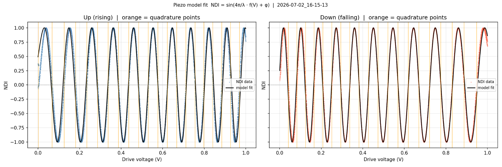

COMMENT: add residual plot for both fits. try a more physically informed model to see if the fit improves
COMMENT: add more detail on the model fit process, phase unwrapping etc

As you can see, the model is fitting decently well to the nonlinearities in the piezo's displacement.
The most important feature of this model is that it effectively reproduces the slope at each quadrature point. This is very important because we operate the interferometer at these quadrature points so that we can exploit linearity in the NDI.

However, the model fit clearly deteriorates for voltages near 0V and 1V. Because of this, in practice we aim to always operate the piezo near 0.5V, and later on I show that we try to navigate to quadrature points that keep the operating voltage in this well behaved region of our piezo model.

We can also take a look at what f(V) looks like exactly!
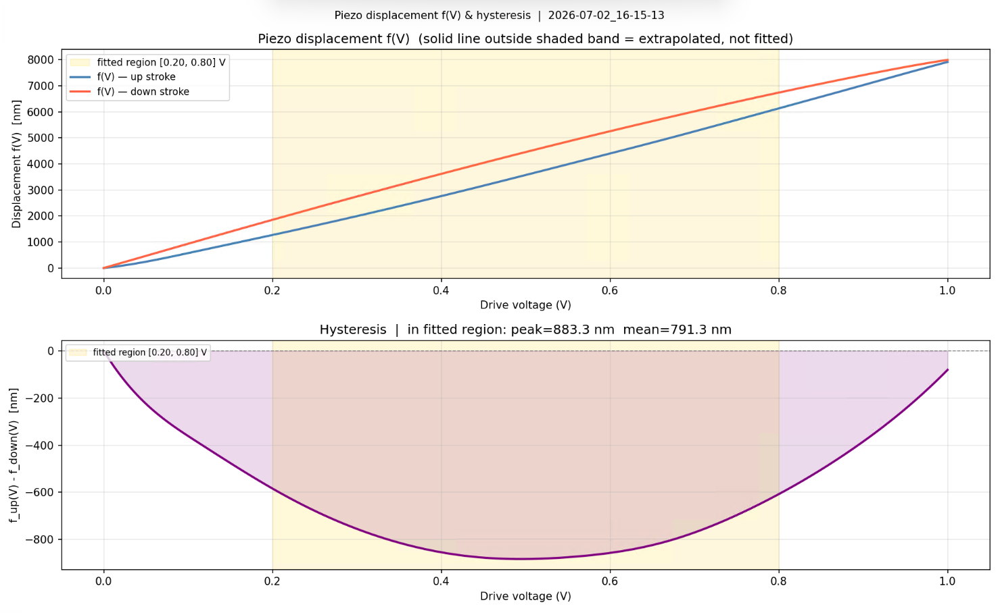

This is a so called "hysteresis diagram". As you can see, the piezo has different behavior in the forward and backward stroke. This also means that we will not return to the same point if we try to go forward some distance and back the same distance by applying a constant voltage. This hysteresis illustrates why closed loop feedback positioning is very important if you need precise and accurate positioning using a piezo stage.

The highlighted band shows the region i've chosen to keep the piezo operating within. In the generated calibration file, I also store the positions of each quadrature point. This is so that we can relatively quickly navigate to a "good" quadrature point where we have a good model of the piezo's behavior.

With that we've solved two main problems:
1. Given a measured NDI, calculate the displacement
2. Given a target displacement, move the piezo to that position

# Remarks
Note that our estimate of displacement as well as our positioning ability depend on how accurate our value for the wavelength of the interferometer is. 

# Testing the piezo
I also wrote a second script called "piezotest.py" which aims to test our calibration process.
Overall, this program aims to navigate to a quadrature point and then use the piezo model we created to move the signal arm a precise distance. We then compare our measured data against the predicted signal. If our piezo model is good, we should be able to get a very good prediction of the measured NDI!

The first step is to navigate to a quadrature point, which I do with a simple PID loop.
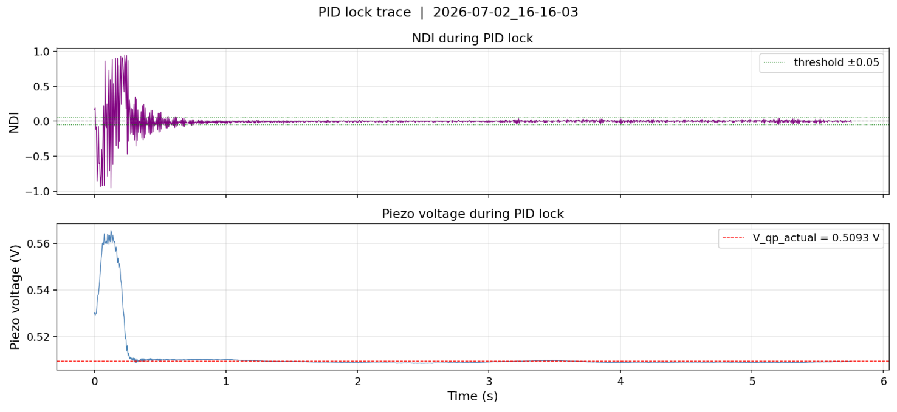

I set a threshold NDI which the PID loop tries to stay within. Additionally, I also enforce that we navigate to a quadrature point with a positive slope. This is just for consistency purposes. 
The quadrature point is first coarsely navigated to using the calibration's suggested quadrature points. In this case we try to go to the quadrature point closest to an applied voltage of 0.5V.

This stage of the process is called the locking process, and it is where we "lock in" to a quadrature point. Once we are able to hold the position at this quadrature point for about 5 seconds without fail, we proceed to the next stage. The purpose of this time delay is to allow the piezo to settle somewhat and reduce what is called "piezo creep".
- Piezo creep is the phenomenon where if you hold the piezo voltage constant, the crystal may continue to slowly expand or contract over the span of a few seconds to minutes as a result of residual charge building up on the crystal.

Anyways, we then use the piezo displacement model to calculate what final voltage we should ramp to such that we displace the mirror exactly 1/8th of a wavelength (which should yield 1/4th of a fringe).
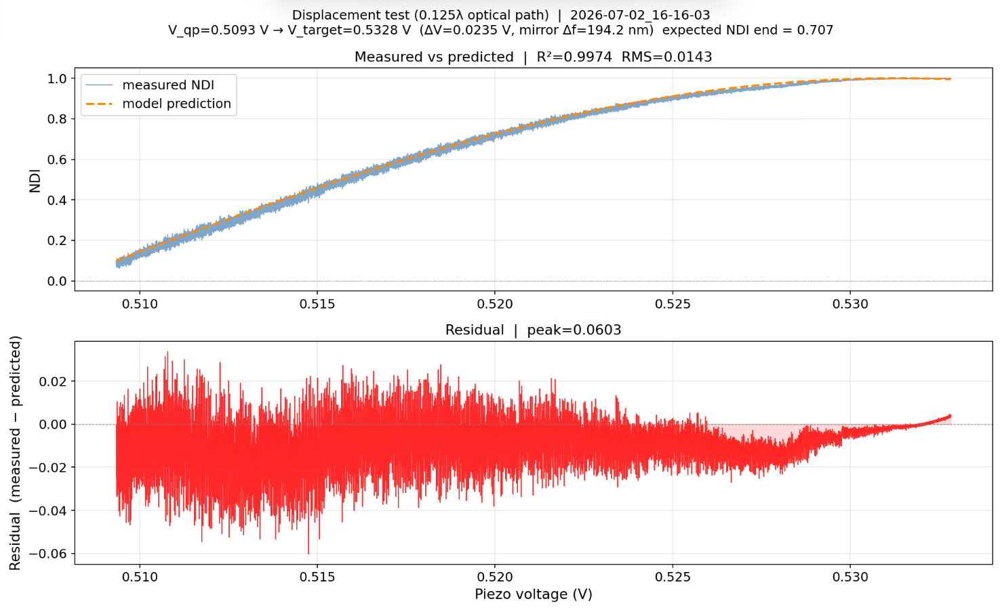
After ramping to that voltage, we compare the signal we measured to the signal we predicted.

COMMENT: perform maybe 100 or so tests and stack them with outlier rejection and see if the residuals decrease. ALso add correction piezo soak in so we start the signal closer to QP

In this case, it appears that we have a pretty good model of the piezo behavior as the residuals are quite small and randomly distributed.  The most important thing is that the slope of our model and the slope of the prediction are very similar about the quadrature point where NDI=0

# Testing the estimator
COMMENT: use CRB?

## Photodiode Linearity Check
I wanted to check the linearity of the relationship between displacement and NDI.

I did this by driving the piezo with a triangle wave (Amplitude of 10nm), essentially in the same fashion as the calibration script. I then collected the NDI from the resulting photodiode data, and plotted NDI on the y axis and piezo position (using the piezo model from before) on the x axis. A best fit line was then fit to it to evaluate how linear the relationship between the two was.

# Applications
## Closed loop feedback positioning
The goal is to specify a displacement from the quadrature point and have the interferometer automatically move to that position and isolate out noise.

First, we navigate to the quadrature point using a PID loop just like before. The quadrature point is selected to be near 0.5V.

Next, we have to move to the specified position. This is done with a two stage PID loop. 
The inner loop attempts to maintain the specified displacement, and functions to dampen out any noise. The outer loop is responsible for slewing to the position.

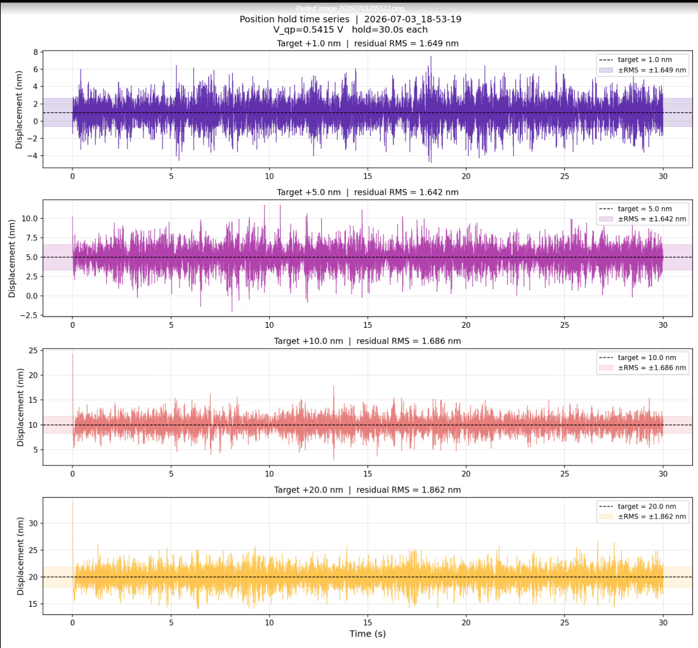

COMMENT: plot histogram of the noise distribution at each RMS, check if it is gaussian

we hold the position for about 30 seconds before moving to the next position.
The above plot shows the RMS displacement as a function of time in each position.

The higher RMS noise of about 1.7-1.9nm is likely due to the slower update frequency of the PID loop. I'm going to try to implement a hardware PID loop and signal processing chain in the FPGA next which should increase this update frequency from 200Hz to on the order of kHz or MHz.

We can demonstrate that this active feedback method is effective in stabilizing the signal mirror
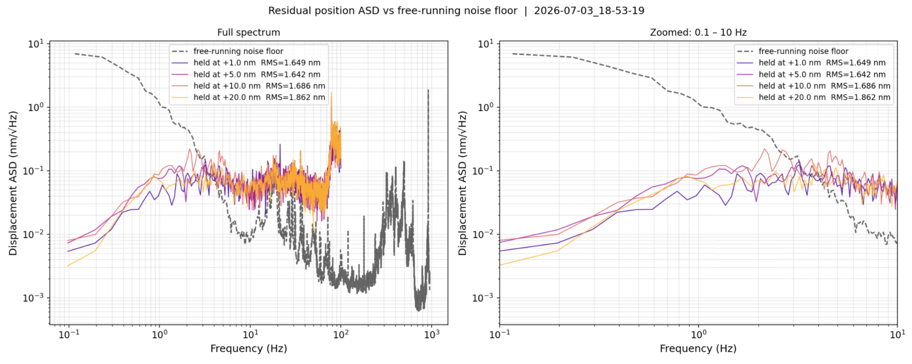

Here, we compare the ambient amplitude spectral density of the interferometer against the stabilized ASDs at each displacement level.

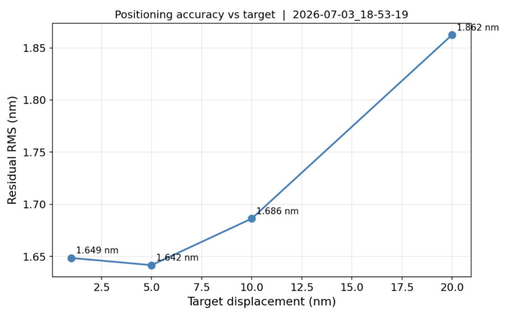

COMMENT:calculate and plot the relative RMS?


Interestingly the RMS displacement noise tends to increase with the amplitude of displacement
## Noise floor estimation
The interferometer was first brought to the quadrature point via a PID loop.
We then measured the displacement of the signal arm over time for the span of roughly 8 seconds (the maximum continuous acquisition time of the scope). 
A slow PID loop which updates with a frequency of about 1/8Hz is used to maintain the interferometer about the quadrature point as piezo creep tends to cause it to drift away.
The resulting signal is stitched together and we use welch's PSD method to estimate the ASD of the interferometer setup.

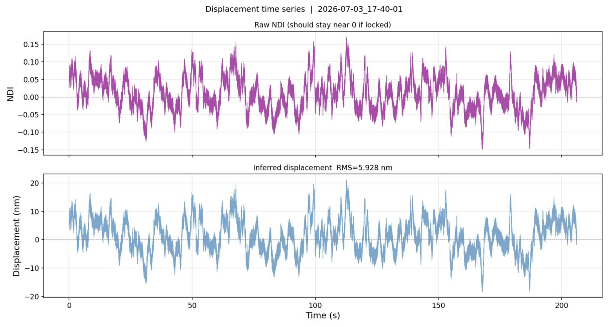
CORRECTION: add vertical bars between acquisitions, add gaps in time for when we are relocking the piezo and reading the ADC buffer

The NDI signal and displacement estimate over time is shown above

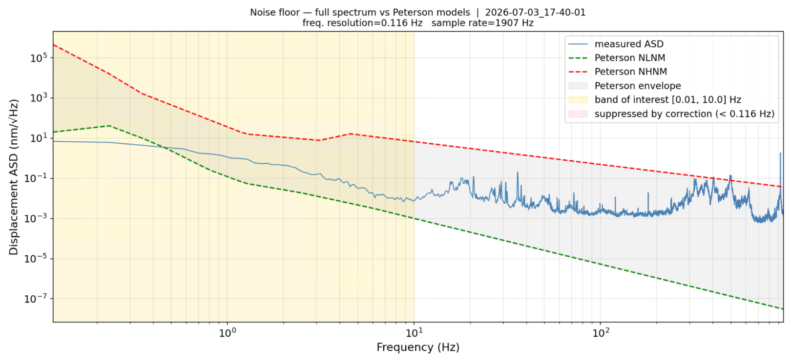

The computed ASD of the interferometer

COMMENT: do this noise floor again with a proper spectrum analyser to see if it improves.
We can also try measuring noise floor by monitoring the control signal of the PID loop
