I have been developing this 200-500nm spectrometer over the last few months so I figured that I should do a quick writeup summarizing my work thus far.

First of all, why a spectrometer? Well this project is being developed principally for the MIT Satelite Team which I am a part of. While the current version isnt space-rated (turns out that designing for space is incredibly complex), it is designed to go onboard a high altitude balloon to perform atmospheric measurements as a testbench for a space-deployed system. 

It turns out that light is actually one of the most information dense signals we can study. Via spectral analysis and other optical methods, we can learn a great deal about the composition and astrophysics of stars and galaxies without ever actually touching them. On the earth we use spectroscopy to analyze chemical compositions and it has been used to discover new elements in the past (helium was discovered via spectroscopy of sunlight, helios).

All together spectroscopy is an incredibly powerful nondestructive measurement method that yields a lot of useful scientific information. Hence it's a natural choice of scientific instrument on a satellite that could be studying atmospheric pollutants.

	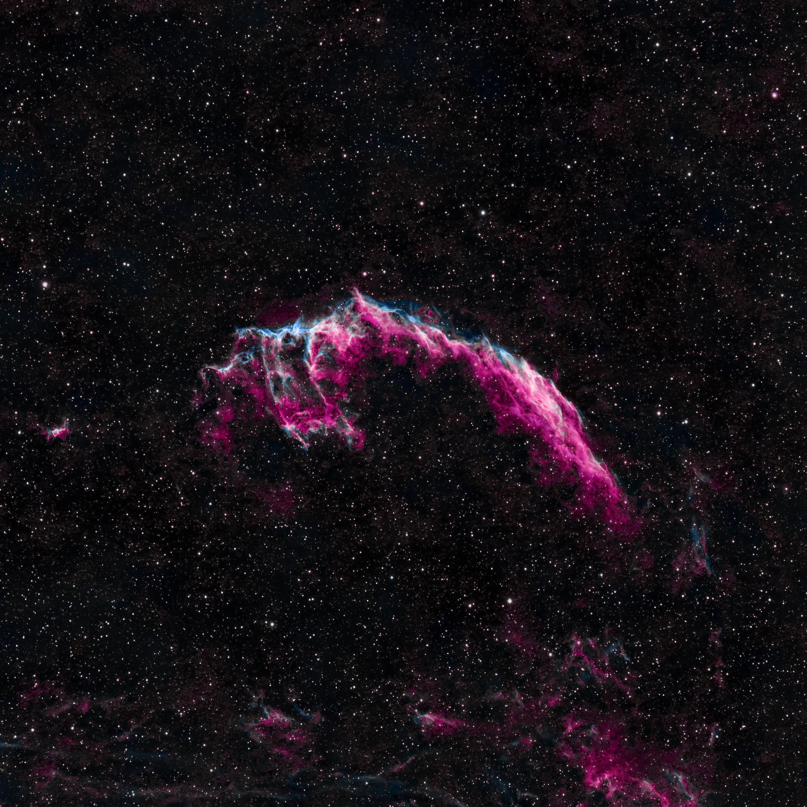
	

		An image of the eastern veil nebula which I captured in July 2025. The colors are informative of the temperature and composition of this supernova fragment.
	

# Rev 0
This project started early this year, around january 2026. Satellite Team was doing their first balloon launch, so thats what kicked off the "first" revision of the spectrometer. Due to immense time constraints, the first iteration was honestly a bit of a mess. I tend to think of this version as the zeroth revision because it never really worked that well at all.

The mechanical enclosure was quite bulky and finicky to align the optics in.

	

	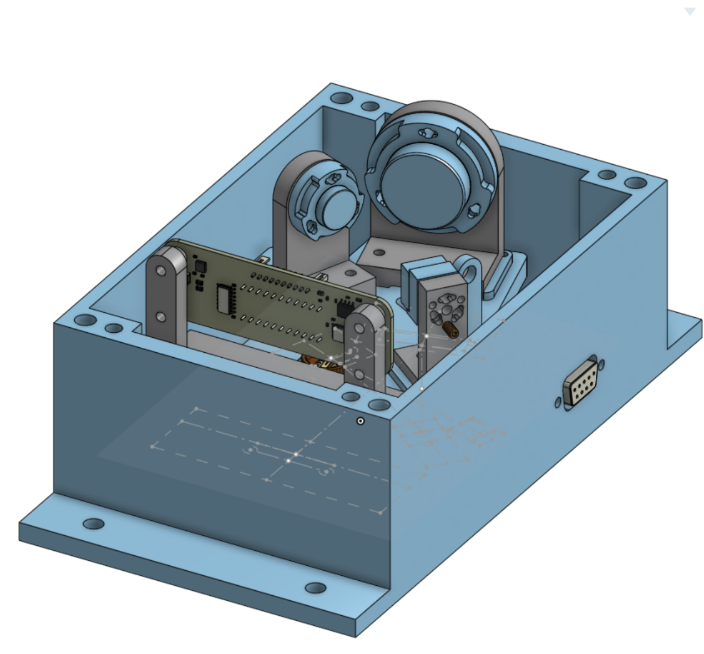
	
 
	

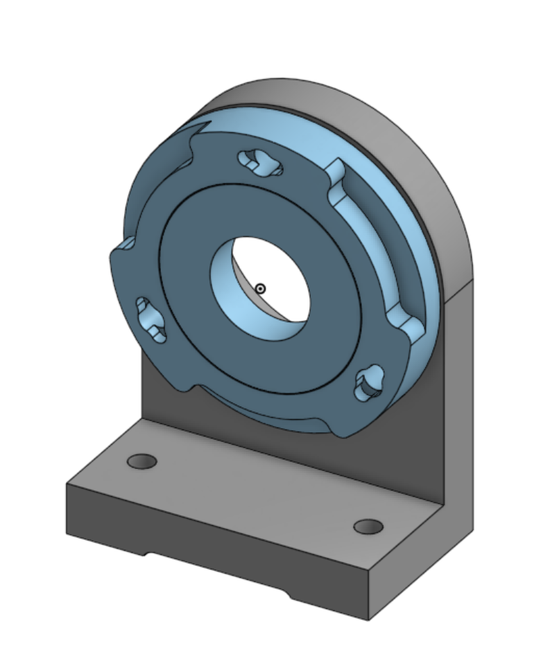

It was essentially a full optical bench in a shoebox. I spent the majority of my time designing the intricate optical mounts of the mirrors and grating. Each kinematic mount has 3 degrees of freedom (2 rotational + 1 translational). designing and manufacturing these miniature kinematic mounts actually taught me a great deal about DFM (design for manufacturing) and CNC machining. I also learned about how to design these large multi-component assemblies from off-the-shelf components that I bought off McMaster. 

	
 

Overall, I'd say that I learnt a great deal about mechanical engineering and design from this first iteration which helped immensely with the later versions of the spectrometer. In particular it was really useful to learn how to perform integration of optical, mechanical, and electronic subsystems.
> One major takeaway I learned from this version was that it would be essential to minimize complexity in the optical mounts.

> I also learned how to attach optics to the mounts. It turns out that a bit of superglue is perfectly sufficient. In production I think that a specialized rubber epoxy is better (3M 2216 Epoxy works great but its a bit tough to remove). Only a few drops of glue or necessary as you dont want to overconstrain the mirror to cause warpage when the underlying plastic grows and shrinks.

The first version of the spectrometer also had a naive implementation of a driver circuit for the NMOS image sensor that we used (Hanamatsu Photonics S3903-1024Q).

	<model-viewer src="rev0.glb" ar ar-modes="webxr scene-viewer quick-look" camera-controls tone-mapping="neutral" poster="poster.webp" shadow-intensity="1" exposure="0.17" environment-image="legacy" auto-rotate style="width:100%; height:500px; background-color: #F0EAD6;"> </model-viewer>

You can view a nifty 3D model of the driver board on this page too!

Taking a closer look at the traces reveals a signal integrity catastrophe

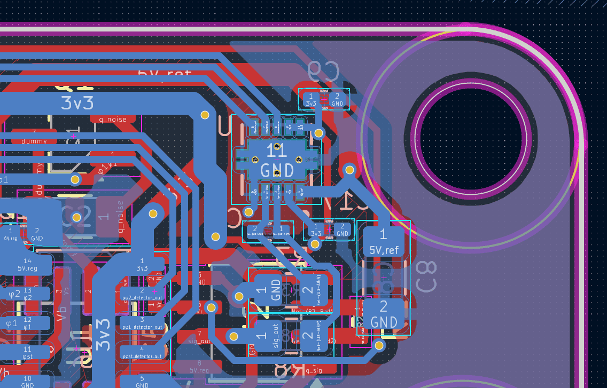

Everywhere that a red and blue line cross is a signal integrity violation. Yikes.

Anyways this was again an extremely naive and poor implementation of a driver circuit as I hadn't had much experience with mixed-signal design before. Don't worry it gets better.

Before we move on to the next design revision, I'd like to share some photos of the actual design in real life.

	

		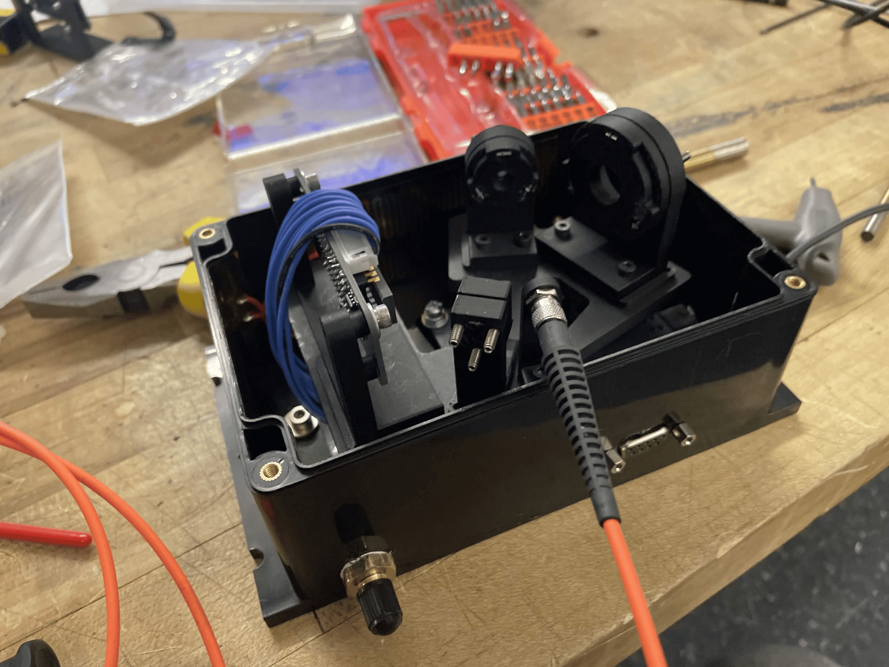
		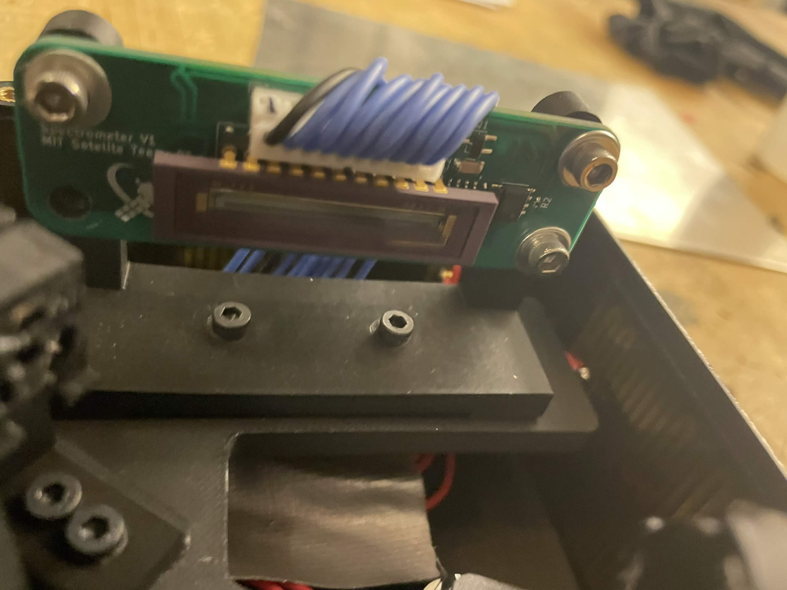
	

	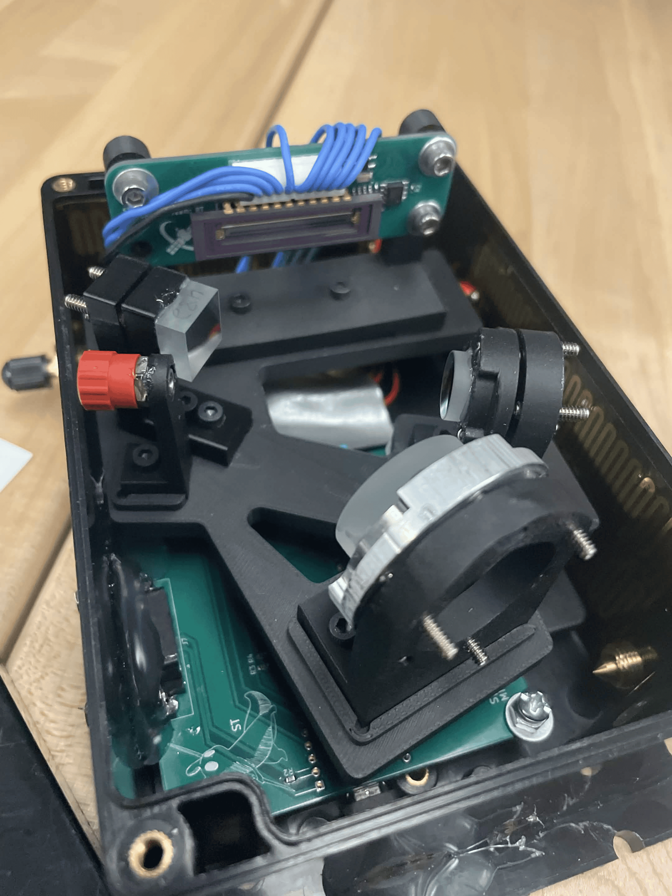

# Rev 1

When summer started, I knew that Rev 0 was nowhere near a completed design so I wanted to make it better. I figured the first place to start would be with a better optical layout.

## Optical Layout Optimization
I started by learning how to use Zemax OpticStudio on their student license. I created the following model of the spectrometer and performed parametric optimization to minimize spot size and optical abberations for the center wavelength of 350nm. I ended up getting the spot width thinner than a single pixel of my detector, so I suppose that'll be sufficient.

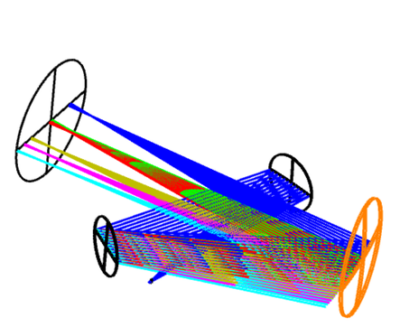
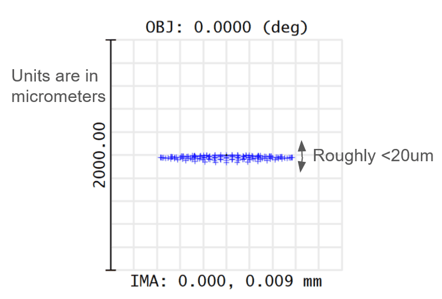

I actually found using Zemax to be quite enjoyable once I picked up on the workflow. I also created some other projects like a little schmidt-cassgrain telescope with aspheric optics :)

## Mechanical Design
Now that I had a more sensible optical layout, I took a screenshot of the ray traced beam path, and imported it into OnShape. I then drew up an enclosure to go around this optical path, taking heavy inspiration from Ocean Optics spectrometers.

The key design decision I made for all revisions going forward was to design the enclosure as a monolithic unit that can be 3D printed easily. I knew from the first version that having every mirror be on an adjustable 3-axis kinematic mount was simply untenable, so I designed for maximal simplicity and minimal cost/assembly complexity.

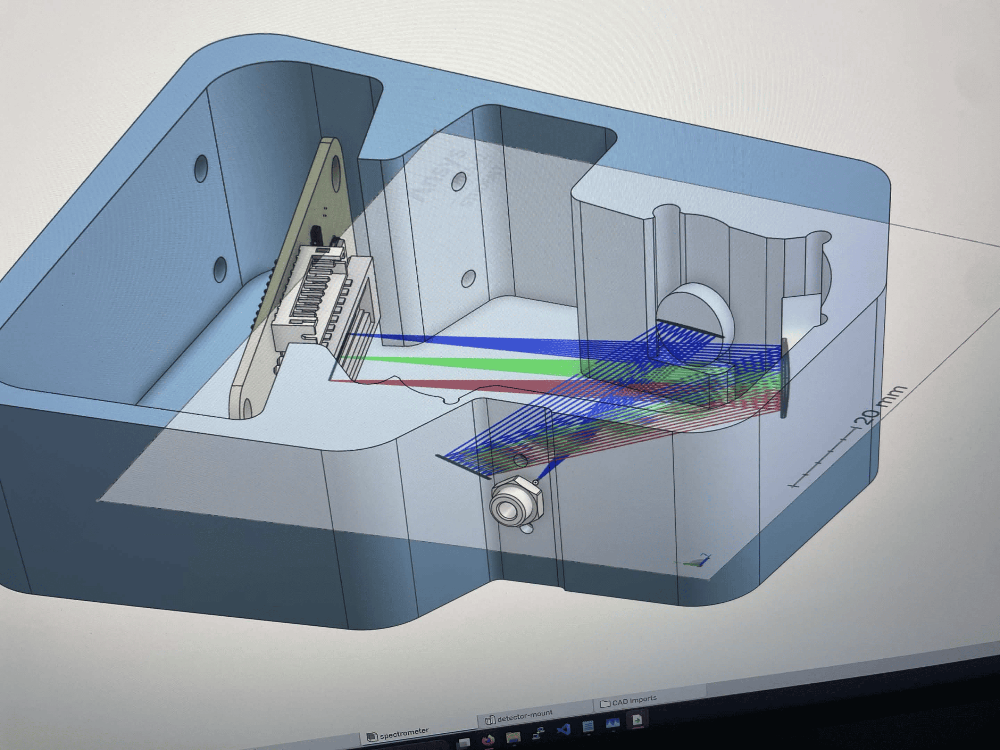

The result of these design efforts was an incredibly smooth assembly process that I could start pretty much the moment the 3d print left the buildplate. I didn't have to buy much hardware and everything just sort of worked.

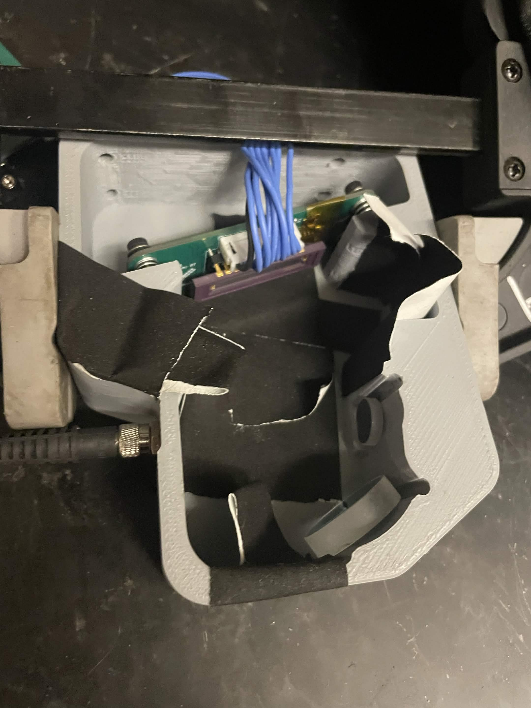

Here you can see how the mirrors are glued in place and fixed via rigid kinematic constraints. In development I added a ton of black tape to serve as flocking paper so I could figure out where to place optical baffles to reduce stray light. 

This first iteration also did not have any slit installed, as I wasn't quite sure how I could implement a mount for the slit that would be easy to install and adjust while packing in an incredibly compact space. You'll see my solution for this problem in the third revision soon enough though.

One major problem that I solved was figuring out how to mount the detector board. Space within the spectrometer is incredibly tight, and I also wanted to minimize mechanical complexity. Ideally, the entire detector mount could be printed in one go, integrated into the monolithic housing. Immediately this meant that the standard solution of a 3-axis kinematic mount was not feasible as they contain numerous tiny bearings, springs, and require tolerances and materials that were not compatible with 3D printing.

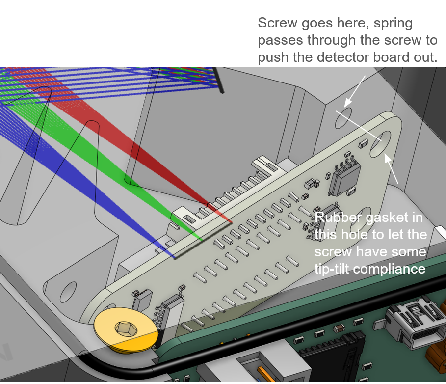

This is the solution I came up with. It essentially integrates a 3-axis kinematic mount into the housing by using the detector PCB's mounting holes themselves as kinematic adjustment points. I pass a screw through the mounting hole and preload the PCB using a small spring and washer. To free up the rotational degrees of freedom, I installed tiny rubber gaskets into the mounting holes that allow the pcb to rotate slightly. This creates a perfectly constrained kinematic mount for the detector PCB, so I could easily adjust the focus while keeping it rigid and repeatable.
> This has to be one of the best engineering problems that I solved while working on this project.

## Electronics

The second iteration of the spectrometer used the same driver board as the first version, so I ended up running into a lot of issues regarding signal integrity.

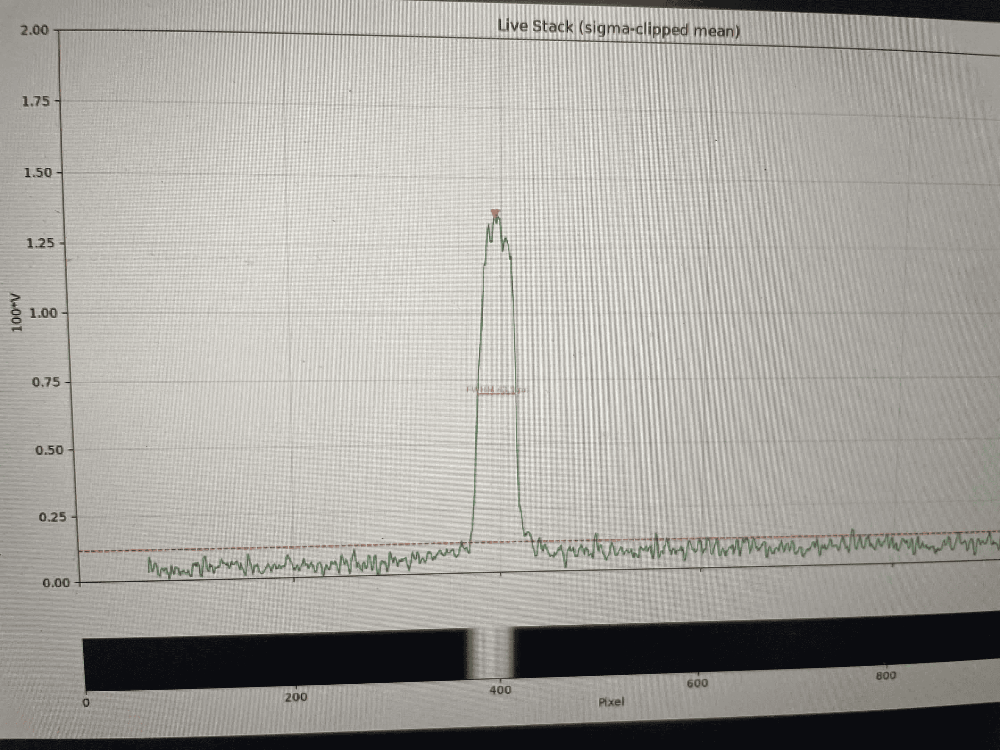

here is a spectrum I captured of a violet laser pointer that I captured with this spectrometer. Evidently, there is a ton of noise in the signal even after stacking nearly 100 exposures. Additionally, the first version of the driver board had insufficient amplification, so I had to do all of it in software which only made the noise worse.

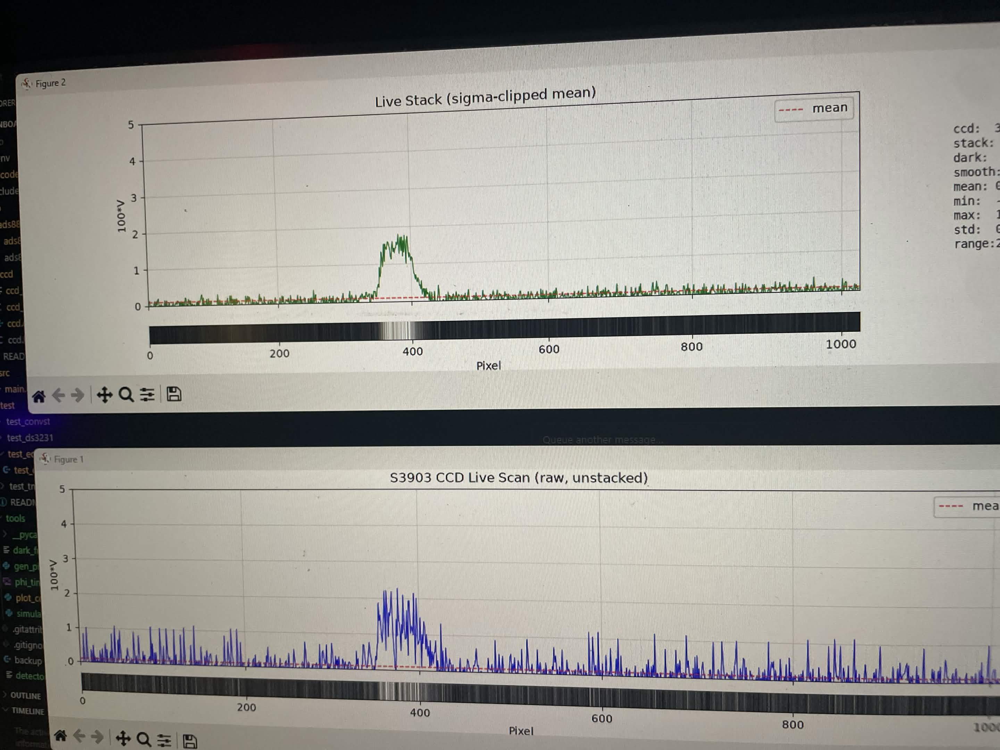

At this point I knew that I needed to develop a new driver board and pay a lot more attention to best practices in PCB design to preserve the signal quality.

Nonetheless, the electronics were certainly sufficient to test the other aspects of the spectrometer like the optical layout and enclosure design. I also learned how to implement rudimentary signal processing to improve the SNR such as image stacking and applying calibration frames.

## Rev 2

## Mechanical Design
Using my findings from the first revision, as well as some computer modelling, I designed a set of light baffles to eliminate stray light from the system. 

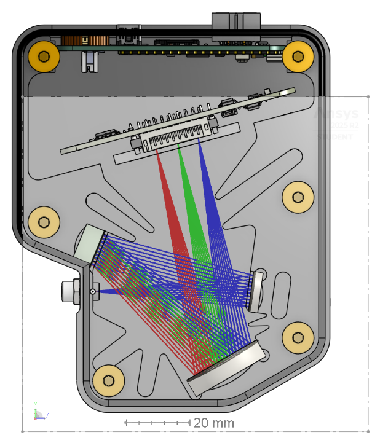

These light baffles ended up working super well as the inside of the spectrometer was incredibly dark when I looked in.

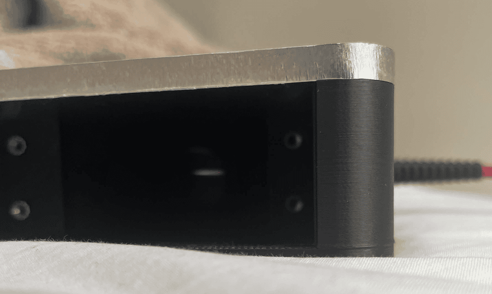

I also figured out how to mount the slit:

	

		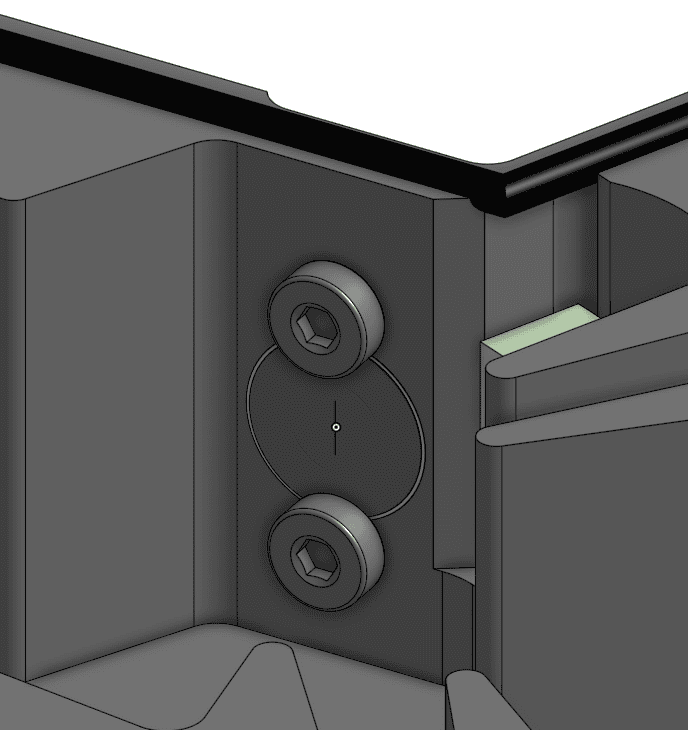
		

		&emsp; The main difficulty was figuring out how to design a mounting solution that was rigid enough but also extremely compact to fit in the housing without interfering with the beam path. On top of these constraints, I wanted the design to be maximally simplistic and easy to manufacture/assemble. 
		&emsp; The slit consists of an extremely thin foil with a 20um slit cut into it. This slit is responsible for reducing the spatial extent of the light coming into the spectrometer and thus increases the sharpness of the spectra. This foil is a mere 50 micrometers thick, so its important to hold it rigidly and prevent deformation that could damage the slit.  
		&emsp; The solution I came up with essentially consists of two miniature screws that gently clamp down the slit about the edge. This minimizes the deformation of the foil while securely mounting it in place. As a bonus its really easy to install and swap out the slit! I ended up installing a small 10um shim to space the slit out away from the fiber optic face. 
		&emsp; If you're curious, the slit I used is the <a href="https://www.thorlabs.com/item/S20HK"> thorlabs S20HK</a>
		

	

	

	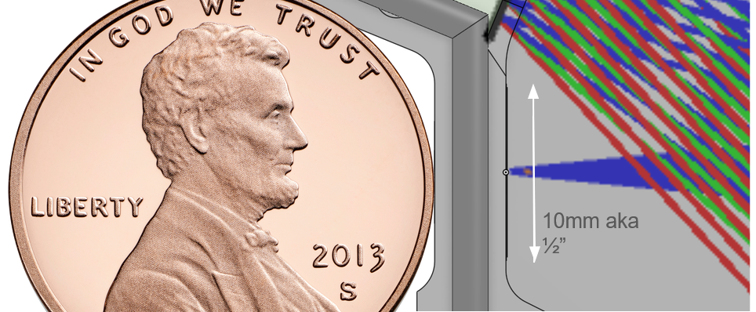
	

Just to give an idea of how small it was, you can see the size compared to a penny.

## Rev 3

The third revision of the spectrometer is currently ongoing. 
As of right now, I'm working on developing an improved driver board and firmware, although there are also some updates with the enclosure that I want to make.

## Electronics
The second iteration of the driver board was actually two separate boards. Using what I learned about signal timing in the first iteration, I opted to generate the timing signals with a CPLD (Complex Programmable Logic Device) instead of bit banging with a microcontroller. This was because I found it far simpler to specify the timing requirements in an HDL versus dealing with scheduling issues and such in a microcontroller.

The second board was essentially just an analog front end that I designed over the course of a week or so, being extremely careful to preserve return current paths, have proper grounding etc. 

	<model-viewer src="rev1.glb" ar ar-modes="webxr scene-viewer quick-look" camera-controls tone-mapping="neutral" poster="poster.webp" shadow-intensity="1" exposure="0.17" environment-image="legacy" auto-rotate style="width:100%; height:500px; background-color: #F0EAD6;"> </model-viewer>

The CPLD board carries the ATF1502AS CPLD from Microchip, as well as three power stages for +5V, -15V, and +15V.

	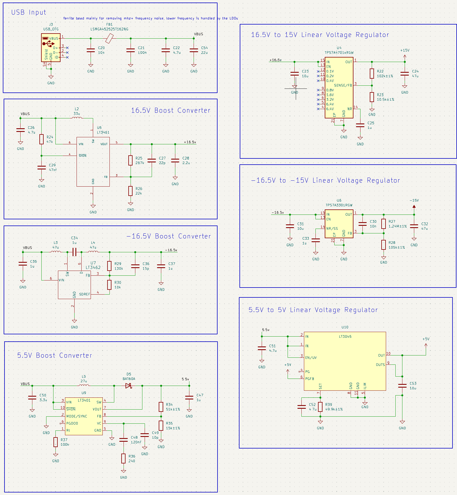

Heres the power stage schematic of the board. To achieve extremely low noise on the power rails supplying the analog front end, I used a buck/boost followed by an LDO. This maximizes efficiency while also keeping noise down which is essential for protecting signal quality in the analog frontend.

Designing the power stage was quite involved, as each buck/boost regulator had its own stability requirements as well as layout requirements for optimal performance. I just ran through the numerous calculations on the datasheets to find the appropriate capacitances needed, and then picked MLCCs that had the right capacitance at the specified DC bias.

I also programmed the CPLD to generate the appropriate timing and simulated it on my laptop too. Here is the timing diagram for driving the S3903-1024Q in GTKWave

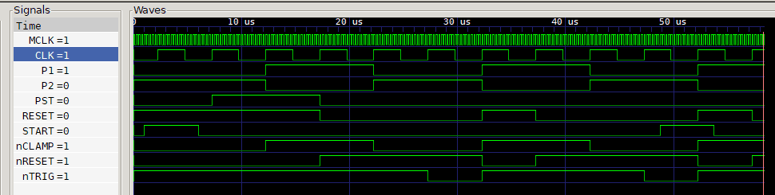

It turns out that the S3903 datasheet actually contains a few errors regarding signal timing (in particular it seems that nCLAMP and CLAMP are flipped) that took me a while to figure out.

The analog front end has also been overhauled substantially. 

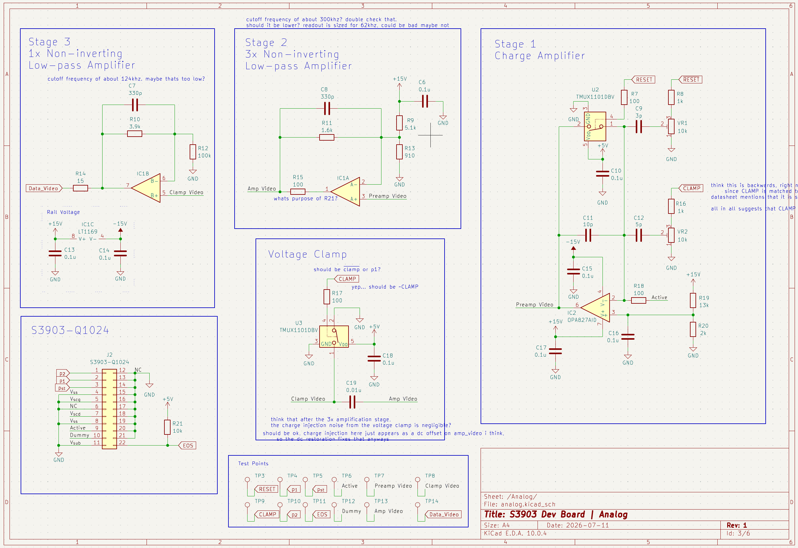

The first stage is a charge amplifier. The sensor outputs a small charge proportional to the incident light intensity, so the charge amplifier integrates this current using a simple capacitor and op amp circuit. The capacitor charge state is cleared via a RESET signal and a charge-injection compensation circuit is used to compensate for any charge that may be injected into the capacitor during the process of switching.

The second stage is a 3x amplifier and low pass filter with a cutoff of about 300KHz. This amplification is important for increasing the signal strength while the low pass filter helps to remove some high frequency switching noise.

The resulting signal passes through a voltage clamp that removes the DC component of the signal, which is important for passing it into the ADC.

Finally, the signal goes through one more low pass filter before being digitized by the ADC.

For this PCB, I selected a 14-bit ADC based on the dynamic range of the sensor and the noise floor of each pixel. A higher bit ADC would be a waste as the extra bits would be spent digitizing noise essentially.

The digital conversion is kept isolated from the analog end via a large ground plane to prevent cross coupling of digital switching harmonics into the analog traces.

These efforts in signal integrity paid off massively, as the new driver board has essentially zero noise down to the quantization limit of the ADC even without stacking. 

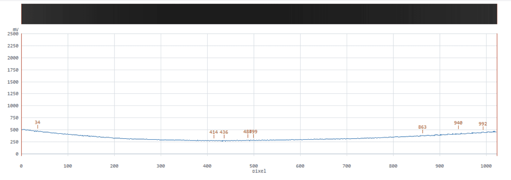

The data is remarkably good without any stacking! After a short stack of about 100 captures (The frame rate was also boosted), there is essentially no noise left.
## The next revision of electronics
The driver board I designed had some flaws nonetheless. I forgot to verify mechanical fit between the PCB and enclosure, and I also flipped some FFC cables in the design. As a result I needed to make a ton of little bodge wire repairs that I'm hoping to fix in the next board spin up.

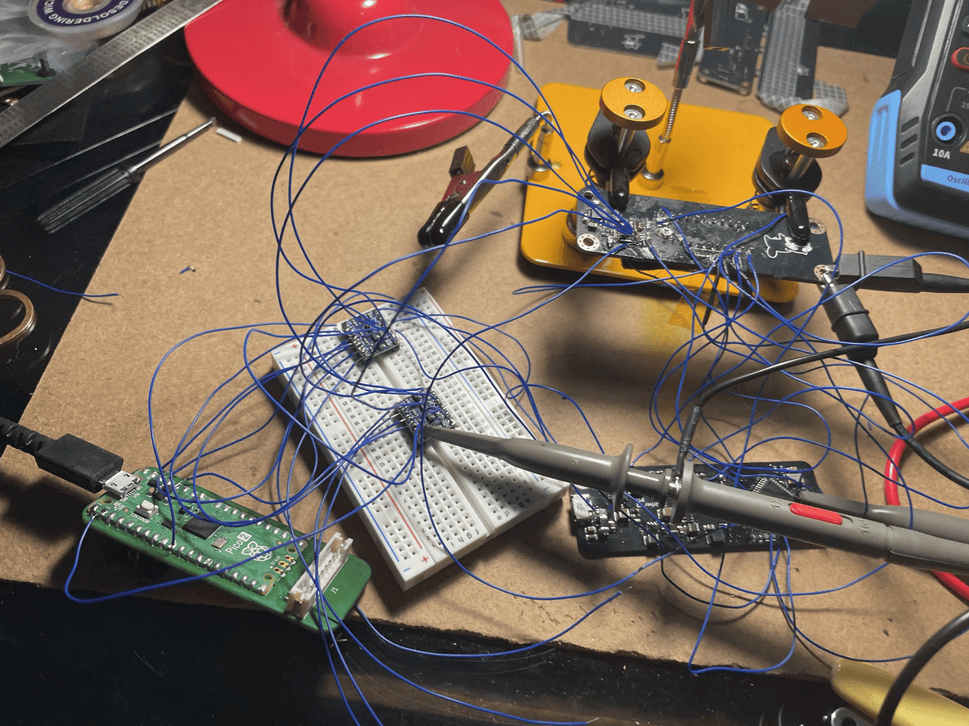

The newer version of the spectrometer electronics actually consists of three boards. The first two are the ones we've already seen, just the analog board and a CPLD board. However, I'm also designing an embedded microcontroller as I want to save space as the RP2350 dev board is a bit too bulky to fit behind with the IO panel of the spectrometer.

	<model-viewer src="rev3.glb" ar ar-modes="webxr scene-viewer quick-look" camera-controls tone-mapping="neutral" poster="poster.webp" shadow-intensity="1" exposure="0.17" environment-image="legacy" auto-rotate style="width:100%; height:500px; background-color: #F0EAD6;"> </model-viewer>

## Mechanical Design
The Rev 3 enclosure is pretty much identical to the Rev 2 enclosure. However, I've added a few small fixes and details.

First, I added a rubber gasket to seal around the lid. This helps to further reduce stray light, but also it prevents ingress of dirt and other contaminants into the optical train.

I also made a few adjustments to the overall sizing so that I can fit the new PCBs in without any snag. 

Finally, I added a small compliant mechanism to adjust the tilt of the collimating mirror of the spectrometer. I found in the previous version that the beam would be deflected vertically and thus miss the detector. A simple way to compensate for this is to allow the collimating mirror to have a small amount of adjustable tilt.

	

		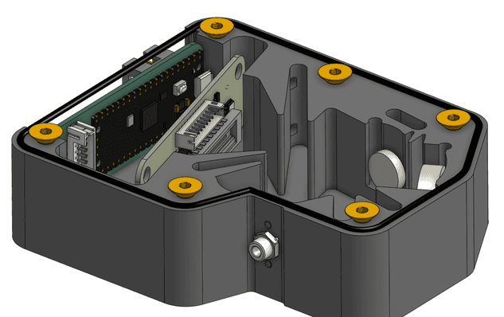
		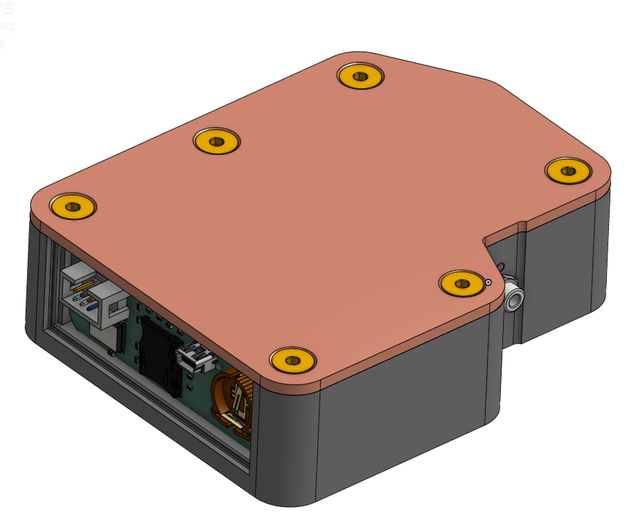
	

	

		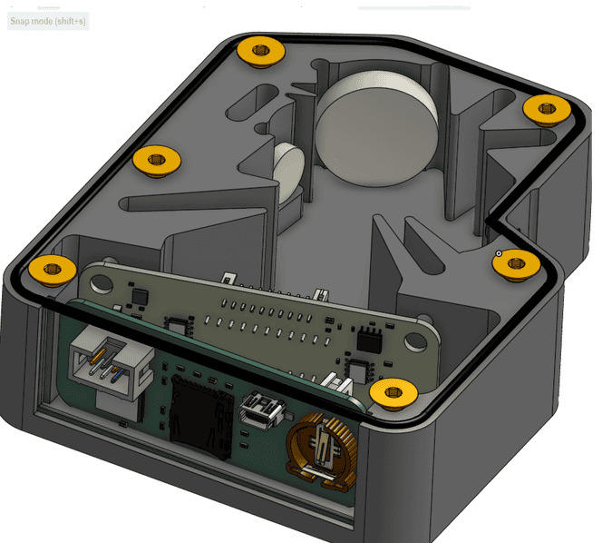
	

## Firmware
The firmware in Rev 3 is significantly improved. The microcontroller performs onboard image stacking and calibration, as well as managing a local filesystem stored in an SD card so that remote data captures can be stored. One major bug that was fixed was the loss of pixels intermittently during scans. This would result in the captured image shifting left and right, as missed pixels would not be detected so the entire image would incur an offset. 

The issue was tracked down to the microcontroller missing ADC read interrupts, causing old readings to go stale and thus pixels would silently disappear. The solution for this was to keep a running clock on the microcontroller so that time was made in the schedule for when a pixel is expected to be available for reading. 

The spectrometer is interfaced with the PC via a desktop app that I created called "Helios".

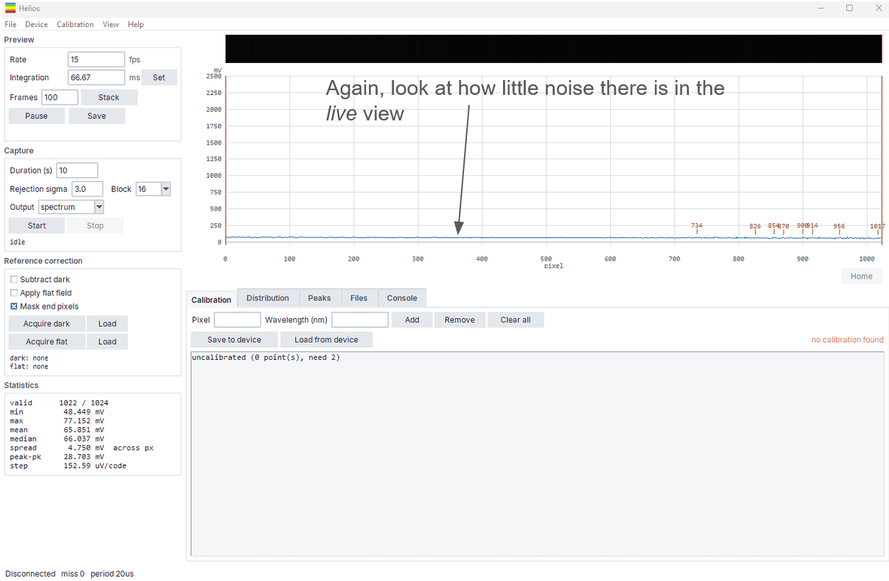

In the desktop app you can connect to the spectrometer and view the live feed, start captures, write calibration files, view image statistics, download spectra files, and also communicate via console commands.

One of the most useful features of the PC app is the ability to analyze pixel distributions. When I was fixing firmware bugs, I found it extremely helpful to examine the intensity distributions on a per-pixel basis as anything other than a pure gaussian indicated something was wrong with the capture process.

# Going forward
I'll be finishing the PCB layout and routing in the coming few weeks, and the third revision should be complete shortly. I'll be updating this page incrementally as I develop this project further though.

This spectrometer is scheduled to be launched onboard a balloon in early spring 2027. In the mean time if you have any questions about this project feel free to email me at ryantang@mit.edu!